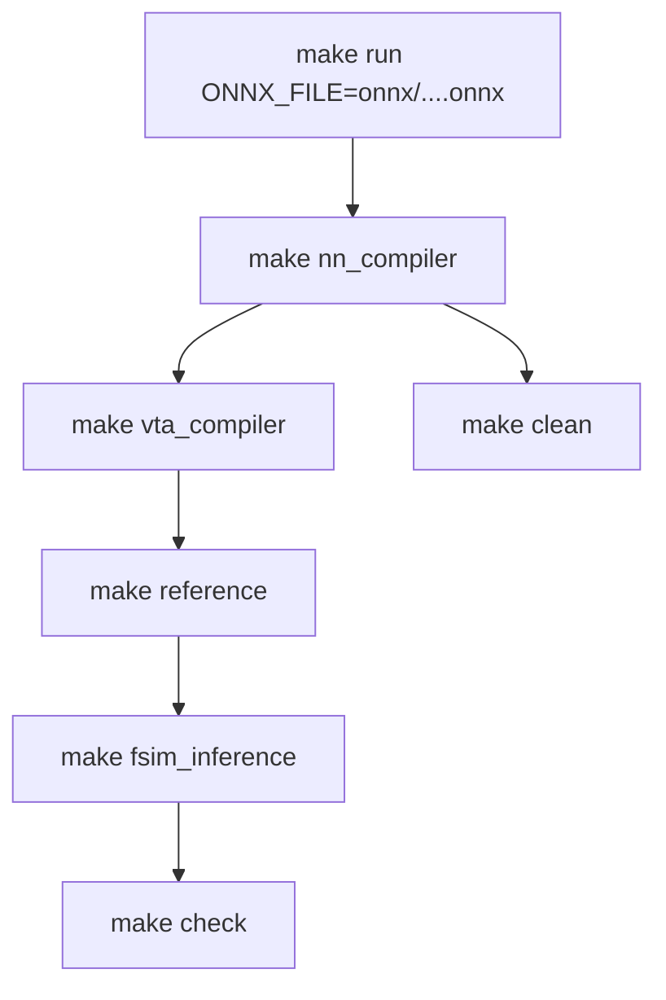

# `make run`（ONNX 整网流水线）完整流程说明

本文档说明在 `examples/` 目录执行 **`make run`**（或指定 `ONNX_FILE=onnx/....onnx`）时发生的全部步骤：ONNX 模型从哪来、调用了哪些子目标、读写哪些路径、生成哪些文件与日志，以及与 **`make test_gemm`** 的差异。

**推荐首次 ONNX 验证（最小单层卷积，约数秒跑通）：**

```bash
conda activate standalone-vta
cd examples

# 若尚未生成模型（或需重新随机权重）
make gen_onnx_qconv

# 完整流水线：NN 编译 → VTA 编译 → 参考值 → FSIM 整网 → 数值校验
make run ONNX_FILE=onnx/qlinearconv_debug.onnx
```

**设计意图：** 走通 **qONNX → VTA IR → VTA 二进制 → 功能仿真（FSIM 整网）→ 金标比对** 的端到端链路，验证 NN 编译器与仿真器在真实量化算子图上的行为。

---

## 1. 总体流程

`run` 在 `examples/Makefile` 中定义为一条「编排」目标，依次调用 5 个子步骤（含嵌套的 `make`）：



| 阶段 | Makefile 目标 | 主要工具 | 输出位置 |
|------|---------------|----------|----------|
| 0 | `clean`（嵌套于 `nn_compiler`） | `rm` | 清空 `compiler_output/*`、`log_output/*` |
| 1 | `nn_compiler` | `vta_backend.py` | `compiler_output/*.json`、`dependency.csv`、权重 bin |
| 2 | `vta_compiler` | `main_vta_compiler.py` | `compiler_output/*QLinearConv*.bin/csv` 等 |
| 3 | `reference` | `reference_onnx.py` | `input_nn.bin`、`reference.bin` |
| 4 | `fsim_inference` | C++ `fsim_nn` | `final_output.bin` |
| 5 | `check` | `check_bin.py` | 终端 → `log_output/prompt_checker.txt` |

**不会执行的内容（与 `make test_gemm` 对比）：**

- 预置 `vta_ir/matmul_16x16.json` 的复制与随机 GEMM 矩阵
- FSIM **单层** `fsim_single_layer` 与 **TSIM** `ComputeApp`

因此 `make run` **会校验数值**：`check` 将 `final_output.bin` 与 `reference.bin` 逐元素比对。

---

## 2. `examples/onnx/` 目录与模型一览

仓库 **`examples/onnx/`** 提供两类资源：

1. **Python 生成脚本** — 用随机 int8 权重/偏置构造 qONNX 调试用模型；
2. **预置 `.onnx` 文件** — 部分已随仓库提供（如 `qyolo_pattern.onnx`），或由脚本重新生成。

### 2.1 生成脚本

| 脚本 | 输出模型 | 图结构 | 建议用途 |
|------|----------|--------|----------|
| `gen_QLinearConv.py` | `qlinearconv_debug.onnx` | 单层 **QLinearConv**（5×5 输入，3×3 卷积，same 填充） | **首次 ONNX 验证**（最快、易 bit-accurate） |
| `gen_QLinearMul.py` | `qlinearmul_debug.onnx` | 单层 **QLinearMul**（常量 × 输入） | 测试 MulConstant 节点 |
| `gen_twoQLinearConv.py` | `two_qlinearconv_debug.onnx` | 两层串联 **QLinearConv**（256×256 特征图） | 多层 VTA IR / FSIM 调度 |
| `gen_pattern.py` | `pattern_debug.onnx` | Conv×2 + Mul + Conv + **QLinearAdd**（重参数化模式） | 含 CPU 节点（Add）的混合图 |
| `quantise_extract/quantise_with_shape.py` | `qyolo_nas_s.onnx` 等 | FP32 → 静态量化（需外部 FP32 源模型） | 大模型量化流水线 |
| `quantise_extract/extract_subgraph.py` | `subgraph.onnx` | 从大模型抽取子图 | 调试 YOLO 类网络片段 |

Makefile 快捷目标（在 `examples/` 下）：

```bash
make gen_onnx_qconv      # qlinearconv_debug.onnx
make gen_onnx_qmul       # qlinearmul_debug.onnx
make gen_onnx_two_conv   # two_qlinearconv_debug.onnx
make gen_onnx_pattern    # pattern_debug.onnx
make gen_onnx_all        # 以上四个 debug 模型
```

### 2.2 预置 / 常用 ONNX 文件

| 文件 | 规模 | Makefile 注释 / 说明 |
|------|------|----------------------|
| `qlinearconv_debug.onnx` | ~457 B | 单层，**推荐入门** |
| `qlinearmul_debug.onnx` | ~388 B | 单层 Mul |
| `two_qlinearconv_debug.onnx` | ~20 KB | 两层 Conv |
| `pattern_debug.onnx` | ~22 KB | 含 QLinearAdd（CPU 执行） |
| `qyolo_pattern.onnx` | ~100 KB | **`ONNX_FILE` 默认值**；子图模式 |
| `qyolo_qconv_maxpool_qconcat.onnx` | ~300 KB | Conv + MaxPool + Concat |
| `qyolo_qconvtranspose.onnx` | ~593 KB | 含 ConvTranspose |
| `qyolo.onnx` | ~11 MB | 完整网络；注释称约 30% 元素在 ±3 内一致 |

切换模型示例：

```bash
make run ONNX_FILE=onnx/two_qlinearconv_debug.onnx
make nn_compiler ONNX_FILE=onnx/pattern_debug.onnx   # 仅 NN 编译
make reference REF_MODE=ort ONNX_FILE=onnx/qlinearconv_debug.onnx  # 用 ORT 作金标
```

---

## 3. 路径与变量（Makefile 约定）

`examples/Makefile` 将项目根目录解析为 `standalone-vta/`（`PROJECT_DIR`）：

| 变量 | 默认值 | 含义 |
|------|--------|------|
| `ONNX_FILE` | `onnx/qyolo_pattern.onnx` | 相对 `examples/` 的 ONNX 路径 |
| `REF_MODE` | `numpy` | 金标模式：`numpy` \| `ort` \| `compare` |
| `DEBUG_PARSE` | `True` | NN 编译器解析调试输出 |
| `EXPANDBIAS_AT_COMPILATION` | `True` | 编译期偏置扩展 |
| `DEBUG` | `False` | VTA 编译器 / 参考 / check 的冗长调试 |
| `COMPILER_OUTPUT_DIR` | `<项目根>/compiler_output/` | 编译与仿真共享数据面 |
| `LOG_OUTPUT_DIR` | `<项目根>/log_output/` | 各阶段 stdout 重定向 |
| `CONFIG` | `<项目根>/config/vta_config.json` | VTA 硬件参数 |

**Python 依赖（Conda 环境 `standalone-vta`）：**

- `onnx`、`onnxruntime`（`environment_setup/standalone-vta.yml` 的 pip 段；若 `nn_compiler` 报 `No module named 'onnxruntime'`，执行 `pip install onnxruntime`）

VTA 编译默认读取 **`config/vta_config.json`**（当前：`LOG_BLOCK=4` → 块大小 **16**；`LOG_*_WIDTH=5` → 累加器 **int32**）。

---

## 4. 分步详解

以下以 **`ONNX_FILE=onnx/qlinearconv_debug.onnx`**（单层 5×5 QLinearConv）为例说明各步行为；多层模型仅在层数、文件名后缀与 CPU 后处理步骤上扩展。

### 步骤 0：`make clean`（嵌套于 `nn_compiler`）

**作用：** 删除上次运行留在输出目录中的文件。

**行为：**

- 若不存在则创建 `compiler_output/`、`log_output/`
- `rm compiler_output/*.*`、`rm log_output/*.*`

**注意：** 不删除 `examples/onnx/*.onnx` 与 `examples/vta_ir/`。

---

### 步骤 1：`make nn_compiler`

**命令：**

```bash
python src/compiler/nn_compiler/vta_backend.py \
  True True \
  config/vta_config.json \
  onnx/qlinearconv_debug.onnx \
  > log_output/prompt_vta_backend.txt
```

**内部流程概要：**

1. **`parse_onnx_to_dict`** — 加载 ONNX，形状推断，构建计算图字典；
2. **逐节点处理** — 识别 VTA 兼容算子（`QLinearConv`、`QLinearMul`、`MaxPool`、`Relu` 等）与 CPU 算子（`QLinearAdd`、`QuantizeLinear`、`QLinearConcat`、`ConvTranspose` 等）；
3. **生成 VTA IR JSON** — 每个 VTA 层一个文件，命名 `{OpType}{index}.json`（本例：`QLinearConv1.json`）；
4. **写出 `dependency.csv`** — 层数、输入图像展平尺寸、执行顺序、每层量化参数与依赖关系；
5. **写出权重/偏置原始 bin** — 如 `QLinearConv1weight_27x3.bin`、`QLinearConv1accumulator_25x3.bin`（命名含矩阵形状）。

**VTA 兼容 vs CPU（摘录自 `vta_backend.py`）：**

| 处理器 | 算子示例 |
|--------|----------|
| VTA | `QLinearConv`, `QLinearMul`, `MaxPool`, `Relu` |
| CPU | `QLinearAdd`, `QuantizeLinear`, `DequantizeLinear`, `QLinearConcat`, `ConvTranspose` |

**本例 `QLinearConv1.json` 语义（片段）：**

- 输入 Im2Col 后矩阵 **A**：25 行 × 3 列（5×5 空间 × 3 通道，3×3 kernel）；
- 权重矩阵 **B**：27 行 × 3 列（3×3×3 kernel × 3 输出通道）；
- **GEMM** 计算 **C = A × B**（含 LOAD/STORE 与偏置路径）。

**日志：** `log_output/prompt_vta_backend.txt`（图结构、VTA IR 统计、执行顺序）。

---

### 步骤 2：`make vta_compiler`

**命令：**

```bash
python src/compiler/vta_compiler/main_vta_compiler.py \
  False True False \
  config/vta_config.json \
  compiler_output/*.json \
  > log_output/prompt_vta_compiler.txt
```

**要点：**

- 输入为 `compiler_output/` 下全部 `*.json`（本例仅 `QLinearConv1.json`）；
- 为每层生成**带层后缀**的二进制与 CSV（与 `test_gemm` 无后缀命名不同）。

**本例典型产物：**

| 文件 | 典型大小 | 角色 |
|------|----------|------|
| `QLinearConv1.json` | ~552 B | VTA IR 副本 |
| `inputQLinearConv1.bin` | 4096 B | 块布局输入（占位/初值；运行时由 `input_nn.bin` 覆盖逻辑输入） |
| `weightQLinearConv1.bin` | 2048 B | 块布局权重 |
| `accumulatorQLinearConv1.bin` | 300 B | 偏置/累加器通道 |
| `uopQLinearConv1.bin` | 20 B | 微操作表 |
| `instructionsQLinearConv1.bin` | 192 B | VTA 指令流 |
| `metadataQLinearConv1.csv` | ~125 B | 矩阵/块维度 |
| `memory_addressesQLinearConv1.csv` | ~164 B | 缓冲地址 |
| `layers_name.csv` | ~172 B | 层表：`nb_vta_ir=1`，层名 `QLinearConv1` |
| `dependency.csv` | ~773 B | NN 编译器写出的依赖（reference/check 读取） |
| `out_init.bin` / `expected_out_sram.bin` | 各 2048 B | 输出 SRAM 初值 / TSIM 期望快照 |

**`layers_name.csv` 示例：**

```csv
Line identifier,Nb of VTA IR,Provide execution log
nb_vta_ir,1,True
Line identifier,VTA IR name,Last physical DRAM address allocated by the layer
0,QLinearConv1,0x60bf
```

---

### 步骤 3：`make reference`

**命令：**

```bash
python src/compiler/reference_computation/reference_onnx.py \
  False numpy \
  onnx/qlinearconv_debug.onnx \
  > log_output/prompt_reference.txt
```

**行为：**

1. 从 **`dependency.csv`** 读取首层输入形状（本例 NCHW `[1,3,5,5]`）；
2. 生成 **随机 int8 输入** `[-128, 127)`；
3. 按 `REF_MODE` 执行推理：
   - **`numpy`**（默认）— 仓库内 `NumPyReferenceEngine`，与 FSIM CPU 路径对齐；
   - **`ort`** — ONNX Runtime；
   - **`compare`** — ORT 结果并与 NumPy 交叉比对；
4. 写出：
   - **`input_nn.bin`** — 输入经 Im2Col/展平后的 int8 矩阵（FSIM 读入）；
   - **`reference.bin`** — 金标输出张量（NCHW int8，与 `final_output.bin` 比对）。

**日志：** `log_output/prompt_reference.txt`。

---

### 步骤 4：`make fsim_inference`

**命令：**

```bash
cd src/simulators/functional_simulator && make -s nn_execute \
  > log_output/fsim_report.txt
```

**前提：** 需已构建 **`build/fsim_nn`**（首次可 `make fsim_compile` 或 `make compile_and_run`）。

**行为：**

- 读取 `compiler_output/layers_name.csv`，按层顺序执行 VTA 指令；
- VTA 层：加载 `inputQLinearConv1.bin` 等，执行 GEMM/Store；
- CPU 层（若存在）：在 C++ 侧执行 QLinearAdd、Requantize 等后处理；
- 最终写出 **`final_output.bin`**（整网输出）。

**日志：** `log_output/fsim_report.txt`（各层执行摘要、CPU 算子日志）。

---

### 步骤 5：`make check`

**命令：**

```bash
python src/compiler/reference_computation/check_bin.py \
  False > log_output/prompt_checker.txt
```

**行为：**

- 从 `dependency.csv` 读取输出张量形状；
- 加载 `reference.bin` 与 `final_output.bin`；
- int8 模式下使用 **`np.array_equal`** 逐元素比对；
- 成功时 Makefile 打印 **`SUCCESS!`**。

**日志：** `log_output/prompt_checker.txt`（不匹配位置、统计信息）。

---

## 5. 目录树（`qlinearconv_debug.onnx` 成功一次后的快照）

```
standalone-vta/
├── compiler_output/
│   ├── QLinearConv1.json
│   ├── QLinearConv1weight_27x3.bin
│   ├── QLinearConv1accumulator_25x3.bin
│   ├── dependency.csv
│   ├── layers_name.csv
│   ├── inputQLinearConv1.bin
│   ├── weightQLinearConv1.bin
│   ├── accumulatorQLinearConv1.bin
│   ├── uopQLinearConv1.bin
│   ├── instructionsQLinearConv1.bin
│   ├── metadataQLinearConv1.csv
│   ├── memory_addressesQLinearConv1.csv
│   ├── input_nn.bin          # reference 阶段
│   ├── reference.bin         # reference 阶段
│   └── final_output.bin      # fsim 阶段
├── log_output/
│   ├── prompt_vta_backend.txt
│   ├── prompt_vta_compiler.txt
│   ├── prompt_reference.txt
│   ├── fsim_report.txt
│   └── prompt_checker.txt
└── src/simulators/functional_simulator/build/
    └── fsim_nn               # 整网功能仿真
```

---

## 6. 与相关目标的对比

| 目标 | 输入 | 编译 | 仿真 | 校验 |
|------|------|------|------|------|
| **`make test_gemm`** | 固定 `vta_ir/matmul_16x16.json` + 随机 bin | 仅 VTA 编译器 | FSIM **单层** + TSIM | 无 |
| **`make run`** | ONNX → NN 编译器 → 多层 JSON | NN + VTA | FSIM **整网** `fsim_nn` | `reference` + `check` |
| `make execute` | 要求 `compiler_output/` 已有完整产物 | 无 | FSIM 整网 + check | 重新跑 reference |
| `make nn_compiler` | 仅 ONNX | NN 编译器 | 无 | 无 |
| `make compile_and_run` | 同 `run` | 同 `run`（另先 `fsim_clean` + `fsim_compile`） | 同 `run` | 同 `run` |

**建议学习顺序：**

1. `make test_gemm` — 验证 VTA 编译 + FSIM/TSIM 环境（见 [`MAKE_TEST_GEMM_cn.md`](MAKE_TEST_GEMM_cn.md)）；
2. `make run ONNX_FILE=onnx/qlinearconv_debug.onnx` — 验证 ONNX 整网流水线；
3. 逐步尝试 `two_qlinearconv_debug.onnx`、`pattern_debug.onnx`、`qyolo_pattern.onnx`。

---

## 7. 常见问题

| 现象 | 可能原因 | 建议 |
|------|----------|------|
| `No module named 'onnx'` / `'onnxruntime'` | Conda 环境未激活或 pip 依赖未装 | `conda activate standalone-vta`；`pip install onnx onnxruntime` |
| `nn_compiler` 找不到 ONNX | 路径相对 `examples/` | 使用 `ONNX_FILE=onnx/qlinearconv_debug.onnx`；或先 `make gen_onnx_qconv` |
| `check` 大量不匹配 | 大模型数值路径与 CPU 实现差异 | 先用 `qlinearconv_debug.onnx`；大模型见 Makefile 注释（`qyolo.onnx` 约 30% ±3） |
| `fsim_nn` 不存在 | 未编译 FSIM | `make fsim_compile` 或 `make compile_and_run` |
| `clean` 报 `cannot remove *.*` | 目录已空 | 可忽略（Makefile 以 `-` 前缀忽略错误） |
| `pattern_debug.onnx` 部分算子在 CPU | 含 `QLinearAdd` | 正常；FSIM 会在 C++ CPU 路径执行 Add |
| 每次输入不同 | `reference` 使用随机 int8 输入 | 固定种子需改 `reference_onnx.py` 或自行写 bin |

---

## 8. 参考源码索引

| 主题 | 路径 |
|------|------|
| `run` / `ONNX_FILE` 定义 | `examples/Makefile` |
| ONNX 生成脚本 | `examples/onnx/gen_*.py` |
| 量化 / 子图工具 | `examples/onnx/quantise_extract/` |
| NN 编译主程序 | `src/compiler/nn_compiler/vta_backend.py` |
| ONNX 解析 | `src/compiler/nn_compiler/parser/parse_onnx_to_dict.py` |
| VTA 编译主程序 | `src/compiler/vta_compiler/main_vta_compiler.py` |
| 金标推理 | `src/compiler/reference_computation/reference_onnx.py` |
| 结果比对 | `src/compiler/reference_computation/check_bin.py` |
| 整网 FSIM | `src/simulators/functional_simulator/src/fsim_nn.cc` |
| FSIM 构建 | `src/simulators/functional_simulator/Makefile` |
| 硬件配置 | `config/vta_config.json` |
| GEMM 快速验证文档 | [`MAKE_TEST_GEMM_cn.md`](MAKE_TEST_GEMM_cn.md) |

---

*文档版本与仓库 `examples/Makefile` 中 `run` / `nn_compiler` 目标一致；若 Makefile 或 `examples/onnx/` 脚本变更，请以源码为准同步更新本文。*
