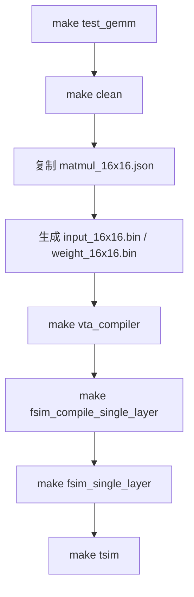

# `make test_gemm` 完整流程说明

本文档说明在 `examples/` 目录执行 **`make test_gemm`** 时发生的全部步骤：调用了哪些子目标、读写哪些路径、生成哪些文件与日志，以及与完整 ONNX 流水线（`make run`）的差异。

**运行方式（在仓库根目录 `standalone-vta/` 下）：**

```bash
conda activate standalone-vta
cd examples
make test_gemm
```

**设计意图：** 跳过 NN 编译器（ONNX → VTA IR），直接使用预置的 **16×16 矩阵乘 VTA IR**，配合随机输入/权重，走完 **VTA 编译 → 功能仿真（FSIM）→ 周期精确仿真（TSIM）** 三段链路，用于首次验证环境与工具链。

---

## 1. 总体流程

`test_gemm` 在 `examples/Makefile` 中定义为一条「编排」目标，依次调用 7 个子步骤（含嵌套的 `make`）：
```bash
test_gemm: ## 16x16 GEMM: VTA compile + FSIM + TSIM (recommended first run)
	@make clean
	@echo "Copy VTA IR in compiler/output"
	@cp ./vta_ir/matmul_16x16.json $(COMPILER_OUTPUT_DIR)
	@echo "Generate random data"
	@python $(COMPILER_DIR)/utils/random_raw_binary_generator.py 16 16 input int32
	@python $(COMPILER_DIR)/utils/random_raw_binary_generator.py 16 16 weight int32
	@echo ""
	@echo "Compile VTA IR"
	@make vta_compiler
	@echo ""
	@echo "Compile FSIM"
	@make fsim_compile_single_layer
	@echo ""
	@echo "Execute FSIM"
	@make fsim_single_layer
	@echo ""
	@echo "Execute TSIM"
	@make tsim

# VTA COMPILER (2nd stage compilation) 
##############
vta_compiler: ## VTA compilation: VTA IRs -> VTA code
	@echo ""
	@echo "COMPILE tests..."
	@date
	$(PYTHON_CMD) \
	$(VTA_COMPILER_DIR)/main_vta_compiler.py \
	$(DEBUG) \
	$(COMPILE_SUMMARY) \
	$(DRAM_JSON) \
	$(CONFIG)/vta_config.json \
	$(JSON_FILES) > $(LOG_OUTPUT_DIR)/prompt_vta_compiler.txt
	@date
```



| 阶段 | Makefile 目标 / 命令 | 主要工具 | 输出位置 |
|------|----------------------|----------|----------|
| 0 | `clean` | `rm` | 清空 `compiler_output/*`、`log_output/*` |
| 1 | 内联 `cp` | shell | `compiler_output/matmul_16x16.json` |
| 2 | `random_raw_binary_generator.py` ×2 | Python / NumPy | `input_16x16.bin`、`weight_16x16.bin` |
| 3 | `vta_compiler` | `main_vta_compiler.py` | `compiler_output/` 全套 bin/csv |
| 4 | `fsim_compile_single_layer` | g++ / make | `src/simulators/functional_simulator/build/fsim_single_layer` |
| 5 | `fsim_single_layer` | C++ FSIM | 终端 → `log_output/fsim_report.txt` |
| 6 | `tsim` | sbt / Chisel | 终端 → `log_output/tsim_report.txt` |

**不会执行的内容（与 `make run` 对比）：**

- `nn_compiler`（ONNX / qONNX 解析）
- `reference` / `check`（ONNX 参考值与结果比对）

因此 `test_gemm` **不保证数值与某个 ONNX 金标一致**，只验证编译与两级仿真能否跑通。

---

## 2. 路径与变量（Makefile 约定）

`examples/Makefile` 将项目根目录解析为 `standalone-vta/`（`PROJECT_DIR`）：

| 变量 | 实际路径 |
|------|----------|
| `COMPILER_OUTPUT_DIR` | `<项目根>/compiler_output/` |
| `LOG_OUTPUT_DIR` | `<项目根>/log_output/` |
| `CONFIG` | `<项目根>/config/` |
| `FSIM_DIR` | `<项目根>/src/simulators/functional_simulator/` |
| `TSIM_DIR` | `<项目根>/src/simulators/cycle_accurate_simulator/` |
| `JSON_FILES` | `compiler_output/*.json`（`vta_compiler` 的输入通配符） |

VTA 编译默认读取 **`config/vta_config.json`**（当前配置：`LOG_BLOCK=4` → 块大小 **16**；`LOG_*_WIDTH=5` → 输入/权重/累加器为 **int32**）。

---

## 3. 分步详解

### 步骤 0：`make clean`

**作用：** 删除上次运行留在输出目录中的文件，避免旧 bin/csv 干扰本次结果。

**行为（`examples/Makefile` → `clean`）：**

- 若不存在则创建 `compiler_output/`、`log_output/`
- `rm compiler_output/*.*`
- `rm log_output/*.*`

**注意：** 只清理这两个目录下的「带扩展名的文件」，不会删除 `examples/vta_ir/` 等源码树。

---

### 步骤 1：复制 VTA IR

```makefile
cp ./vta_ir/matmul_16x16.json $(COMPILER_OUTPUT_DIR)
```

**源文件：** `examples/vta_ir/matmul_16x16.json`

**语义（VTA IR 片段）：**

```json
{
  "NAME": "",
  "MATRICES": {
    "A": [16, 16, "../compiler_output/input_16x16.bin"],
    "B": [16, 16, "../compiler_output/weight_16x16.bin"],
    "C": [16, 16, "output"]
  },
  "LOAD": { "INP": ["A"], "WGT": ["B"] },
  "GEMM": ["C", "A", "B"],
  "STORE": { "C": ["C"] }
}
```

| 字段 | 含义 |
|------|------|
| `NAME` | 空字符串 → 后续生成文件名**无层后缀**（如 `instructions.bin` 而非 `instructions_L1.bin`） |
| `MATRICES.A/B` | 从 `compiler_output/` 读取原始行主序矩阵二进制 |
| `GEMM` | 计算 **C = A × B**（在 VTA 块布局与微指令语义下） |
| `STORE` | 将结果写回输出缓冲 |

复制到 `compiler_output/` 后，`vta_compiler` 通过 `JSON_FILES := compiler_output/*.json` 自动拾取该文件。

---

### 步骤 2：生成随机输入/权重

```bash
python src/compiler/utils/random_raw_binary_generator.py 16 16 input int32
python src/compiler/utils/random_raw_binary_generator.py 16 16 weight int32
```

**参数：** 行数 16、列数 16、逻辑名 `input`/`weight`、dtype `int32`。

**算法：**

- 在 `[-8, 7]` 上均匀随机整数（`random_bound = 8`）
- 以 **行主序** 写入二进制（`numpy.ndarray.tofile`）

**生成文件：**

| 文件 | 典型大小 | 说明 |
|------|----------|------|
| `compiler_output/input_16x16.bin` | 1024 B | 16×16×4 字节，供 VTA 编译器读入矩阵 A |
| `compiler_output/weight_16x16.bin` | 1024 B | 矩阵 B |

路径由 `find_project_root()` 定位仓库根下的 `compiler_output/`（与 Makefile 中 `COMPILER_OUTPUT_DIR` 一致）。

---

### 步骤 3：`make vta_compiler`

**命令：**

```bash
python src/compiler/vta_compiler/main_vta_compiler.py \
  False True False \
  config/vta_config.json \
  compiler_output/*.json \
  > log_output/prompt_vta_compiler.txt
```

**参数含义：**

| 位置 | 值 | 含义 |
|------|-----|------|
| argv[1] `DEBUG` | `False` | 关闭冗长调试打印（仍可有 SUMMARY） |
| argv[2] `COMPILE_SUMMARY` | `True` | 打印编译摘要 |
| argv[3] `DRAM_JSON` | `False` | 不生成 `dram_state.json` |
| argv[4] | `vta_config.json` | 硬件位宽、块大小、SRAM 容量等 |
| argv[5+] | `compiler_output/*.json` | 本例仅 `matmul_16x16.json` |

#### 3.1 编译器内部在做什么

对 VTA IR 的一次遍历大致包括：

1. **读配置** — 由 `LOG_BLOCK` 等推导块大小、数据类型、片上缓冲容量。
2. **加载矩阵** — 从 `input_16x16.bin`、`weight_16x16.bin` 读入 A、B；按块划分（本例 16×16 且块大小 16 → **单块**）。
3. **分块与调度** — `matrix_partitioning` 生成执行步骤；`operations_definition` 生成 **微操作（UOP）** 与 **指令（insn）** 序列。
4. **DRAM 分配** — 为 INP/WGT/ACC/OUT/UOP/INSN 分配物理/逻辑地址（写入 CSV）。
5. **写二进制** — 将块化后的数据、指令流写入 `compiler_output/`。

本例典型摘要（见 `log_output/prompt_vta_compiler.txt`）：

- **1** 个编译步骤（`nb_steps=1`）
- **2** 条 UOP（`uop.bin`，8 字节）
- **11** 条指令（`instructions.bin`，176 字节）

#### 3.2 `compiler_output/` 生成文件一览

执行成功后，该目录通常包含（**`NAME` 为空，故无 `_Lx` 后缀**）：

| 文件 | 典型大小 | 角色 |
|------|----------|------|
| `matmul_16x16.json` | ~294 B | 输入 VTA IR 副本 |
| `input_16x16.bin` | 1024 B | 原始矩阵 A（编译器输入） |
| `weight_16x16.bin` | 1024 B | 原始矩阵 B |
| `input.bin` | 1024 B | **块布局**后的输入（FSIM/TSIM 加载） |
| `weight.bin` | 1024 B | **转置块布局**后的权重 |
| `accumulator.bin` | 1024 B | 累加器初值（本 IR 未显式 LOAD ACC，仍分配缓冲） |
| `add_accumulator.bin` | 0 B | 第二累加器通道（未使用） |
| `out_init.bin` | 1024 B | 输出 SRAM 初始状态 |
| `expected_out_sram.bin` | 1024 B | 供 TSIM 对比的期望 SRAM 快照 |
| `uop.bin` | 8 B | 微操作表 |
| `instructions.bin` | 176 B | VTA 指令流入口（FSIM 从物理地址执行） |
| `metadata.csv` | ~127 B | 矩阵/块维度元数据 |
| `memory_addresses.csv` | ~164 B | 各缓冲物理/逻辑基址 |
| `layers_name.csv` | ~160 B | 层表：层数、是否打印日志、DRAM 末地址 |

**`metadata.csv` 示例（16×16 GEMM）：**

```csv
Matrix (or Block Size),Nb rows,Nb columns,Is it square?
BS,16,16,True
A,16,16,True
X,16,16,False
Y,0,0,True
C,16,16,True
```

**`memory_addresses.csv` 示例：**

```csv
Buffer type,Physical address (hex),Logical address (hex)
INP,0x1000,0x40
WGT,0x2000,0x8
ACC,0x3000,0xc0
OUT,0x4000,0x100
UOP,0x5000,0x1400
INSN,0x6000,0x600
```

**`layers_name.csv` 示例：**

```csv
Line identifier,Nb of VTA IR,Provide execution log
nb_vta_ir,1,True
Line identifier,VTA IR name,Last physical DRAM address allocated by the layer
0,,0x60af
```

第二段中 `VTA IR name` 为空，与 `NAME: ""` 一致；`Provide execution log` 为 `True` 时，FSIM 会打印 profiler JSON。

#### 3.3 日志

| 文件 | 内容 |
|------|------|
| `log_output/prompt_vta_compiler.txt` | VTA 编译器 stdout：JSON 解析、flag_dict、步数/UOP/insn 统计、输出目录 |

---

### 步骤 4：`make fsim_compile_single_layer`

**命令：** 在 `src/simulators/functional_simulator/` 下执行 `make build/fsim_single_layer`。

**产物：**

- 可执行文件：`src/simulators/functional_simulator/build/fsim_single_layer`
- 依赖：从 `config/vta_config.py` 生成 `build/vta_config_def.txt`，编译 `sim_driver`、`sim_tlpp`、`virtual_memory` 及 TVM 兼容运行时桩等。

**说明：** 仅编译，不运行。若源码未改，重复 `test_gemm` 会增量链接，速度较快。

---

### 步骤 5：`make fsim_single_layer`

**命令：**

```bash
cd src/simulators/functional_simulator && make -s execute \
  > ../../log_output/fsim_report.txt
```

即运行 `build/fsim_single_layer`，标准输出/错误重定向到日志。

#### 5.1 FSIM 读取哪些文件

程序从 **仓库根** 的 `compiler_output/` 加载（相对 FSIM 构建目录向上三级）：

| 读取 | 路径模式 |
|------|----------|
| 层表 | `layers_name.csv` |
| 元数据 | `metadata.csv`（`metadata` + 层后缀，本例后缀为空） |
| 数据 | `input.bin`, `weight.bin`, `accumulator.bin`, `add_accumulator.bin` |
| 程序 | `uop.bin`, `instructions.bin` |

#### 5.2 执行逻辑（摘要）

1. 分配虚拟 VTA 设备与 DRAM。
2. 按 `metadata.csv` 做块格式化，将 host 向量拷入模拟 DRAM。
3. 以 `instructions.bin` 物理地址为入口调用 `VTADeviceRun`。
4. 将结果拷回 host，打印 **16×16 结果矩阵**（int32）。
5. 若 `layers_name.csv` 中日志开关为真，打印 **Profiler** 统计。

**典型 Profiler（`fsim_report.txt` 末尾）：**

```json
{
 "inp_load_nbytes":1024,
 "wgt_load_nbytes":1024,
 "acc_load_nbytes":1024,
 "uop_load_nbytes":8,
 "out_store_nbytes":1024,
 "gemm_counter":16,
 "alu_counter":0
}
```

`gemm_counter: 16` 与 16×16 块内 GEMM 迭代次数一致；`alu_counter: 0` 表示本层无 ALU 融合。

#### 5.3 日志

| 文件 | 内容 |
|------|------|
| `log_output/fsim_report.txt` | 层加载信息、**RESULT LAYER 0** 全矩阵、Profiler JSON、make 嵌套提示 |

FSIM **默认不把结果写回新的 bin 文件**；矩阵仅出现在日志的标准输出中。若需落盘，需自行改 FSIM 或增加后处理。

---

### 步骤 6：`make tsim`

**命令：**

```bash
cd src/simulators/cycle_accurate_simulator && \
  sbt "runMain org.scalatest.run cli.ComputeApp" \
  > ../../../log_output/tsim_report.txt
```

**入口类：** `ComputeApp`（`ComputeSimulator.scala`），固定从 **`compiler_output/`** 读取下列文件（**无层后缀**）：

| 文件 | 用途 |
|------|------|
| `instructions.bin` | 指令流 |
| `uop.bin` | 微操作 |
| `input.bin` | 输入张量（块布局） |
| `weight.bin` | 权重 |
| `out_init.bin` | 输出初始值 |
| `accumulator.bin` | 累加器 |
| `expected_out_sram.bin` | 期望 SRAM 内容（对比用） |
| `memory_addresses.csv` | 各缓冲基址 |

`doCompare = false` 时主要做 **周期级指令推进与调试打印**，不强制与 FSIM 矩阵逐元素断言。

#### 6.1 日志里常见内容

| 文件 | 内容 |
|------|------|
| `log_output/tsim_report.txt` | sbt 启动信息、ScalaTest 运行、`Cycle N:` 下每条 **Compute 类** 指令（如 LUOP、GEMM、LACC、FNSH）的发射记录、Scratchpad 调试等 |

**与 FSIM 的关系：** 二者消费**同一套** `compiler_output` 产物；FSIM 偏「功能正确 + 快速出矩阵」，TSIM 偏「硬件时序与指令解码路径」。首次运行 TSIM 可能触发 sbt 依赖下载，耗时明显长于前几步。

**环境：** 需 JDK 17、sbt；Verilator 多用于更完整的 Chisel 测试目标，本 `ComputeApp` 路径以 Scala 仿真为主（详见 `README_cn.md` TSIM 章节）。

---

## 4. 目录树（成功一次后的快照）

```
standalone-vta/
├── compiler_output/          # 编译 + 仿真共享数据面
│   ├── matmul_16x16.json
│   ├── input_16x16.bin
│   ├── weight_16x16.bin
│   ├── input.bin
│   ├── weight.bin
│   ├── accumulator.bin
│   ├── add_accumulator.bin
│   ├── out_init.bin
│   ├── expected_out_sram.bin
│   ├── uop.bin
│   ├── instructions.bin
│   ├── metadata.csv
│   ├── memory_addresses.csv
│   └── layers_name.csv
├── log_output/
│   ├── prompt_vta_compiler.txt
│   ├── fsim_report.txt
│   └── tsim_report.txt
└── src/simulators/functional_simulator/build/
    └── fsim_single_layer      # 步骤 4 构建的可执行文件
```

---

## 5. 与相关目标的对比

| 目标 | 输入 | 编译 | 仿真 | 校验 |
|------|------|------|------|------|
| **`test_gemm`** | 固定 `vta_ir/matmul_16x16.json` + 随机 bin | VTA 编译器 | FSIM 单层 + TSIM `ComputeApp` | 无 ONNX check |
| `make run` | ONNX → NN 编译器 → 多层 JSON | VTA + NN | FSIM **整网** `fsim_nn` | `reference` + `check`（见 [`MAKE_ONNX_RUN_cn.md`](MAKE_ONNX_RUN_cn.md)） |
| `tutorials/tutorial2_operations_definition.py` | 脚本内嵌算子 | 同类 VTA 编译逻辑 | 文档指引手动 FSIM/TSIM | 教程验证 |

---

## 6. 指令级行为（延伸阅读）

本例 **11 条指令 / 2 条 UOP** 的语义与字段定义见：

- [`VTA_ISA_REFERENCE_cn.md`](VTA_ISA_REFERENCE_cn.md)
- `src/compiler/vta_compiler/operations_definition/README.md`

`tsim_report.txt` 中可见典型模式：多条 **LUOP + GEMM** 块（对应分块乘加），夹杂非 Compute 类指令（Load/Store 等被跳过打印），最后 **FNSH** 结束。

---

## 7. 常见问题

| 现象 | 可能原因 | 建议 |
|------|----------|------|
| `vta_compiler` 找不到 json | `clean` 后未执行 `cp` 或 `compiler_output` 无 `*.json` | 确认先跑完整 `test_gemm` 或手动复制 IR |
| FSIM 找不到 bin | 工作目录或 `compiler_output` 路径错误 | 从 `examples/` 调用 make，勿单独挪动 bin |
| TSIM sbt 失败 | 未装 JDK/sbt、网络拉依赖失败 | 按 `README_cn.md` 配置 TSIM；可暂时只跑到 FSIM |
| 每次结果不同 | 随机 `input_16x16` / `weight_16x16` | 固定种子或改用手写 bin |
| `make help` 无 `test_gemm` | 旧 Makefile | 使用已带 `##` 文档的 `examples/Makefile` |

---

## 8. 参考源码索引

| 主题 | 路径 |
|------|------|
| `test_gemm` 定义 | `examples/Makefile` |
| VTA IR | `examples/vta_ir/matmul_16x16.json` |
| 随机矩阵 | `src/compiler/utils/random_raw_binary_generator.py` |
| VTA 编译主程序 | `src/compiler/vta_compiler/main_vta_compiler.py` |
| 单层 FSIM | `src/simulators/functional_simulator/src/fsim_single_layer.cc` |
| FSIM 构建 | `src/simulators/functional_simulator/Makefile` |
| TSIM ComputeApp | `src/simulators/cycle_accurate_simulator/src/main/scala/cli/ComputeSimulator.scala` |
| 硬件配置 | `config/vta_config.json` |

---

*文档版本与仓库 `examples/Makefile` 中 `test_gemm` 目标一致；若 Makefile 变更，请以源码为准同步更新本文。*
