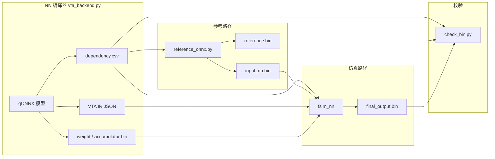
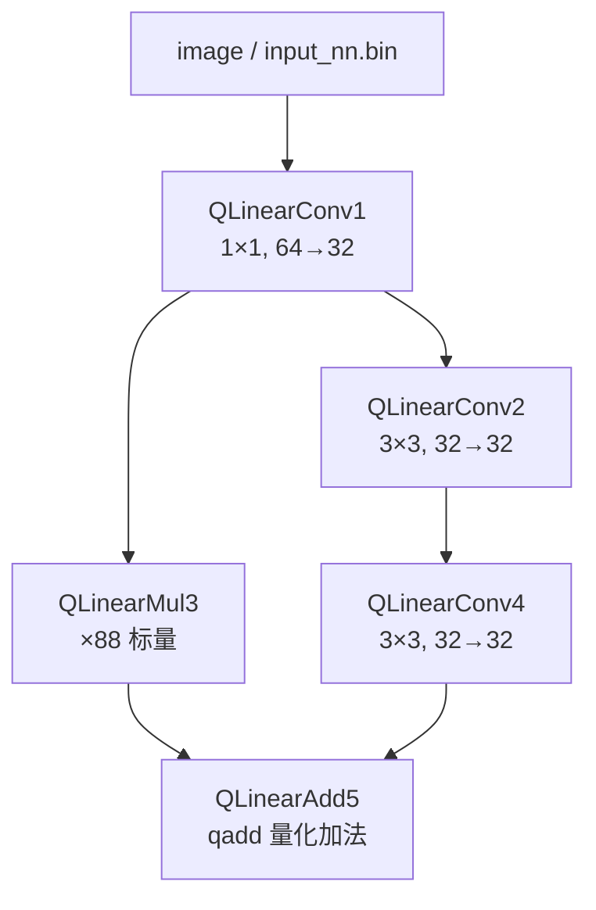

# dependency.csv 详解

本文逐段解释 NN 编译器（`vta_backend.py`）在 `compiler_output/dependency.csv` 中写出的整网调度与元数据表。

- **第 3–13 节**：以单层 `QLinearConv`（`qlinearconv_debug.onnx`）为例，逐字段说明 CSV 格式。
- **第 14 节**：以当前 `compiler_output/dependency.csv` 中的 **5 步多阶段网络** 为例，说明层间依赖、分支与混合处理器调度。

---

## 1. 这个文件是做什么的？

`dependency.csv` 是 **整网的总调度表**，连接 NN 编译、参考计算与功能仿真三条链路：

| 读取方 | 文件 | 主要用途 |
|--------|------|----------|
| `reference_onnx.py` | Python | 从首层字段还原输入 NCHW 形状，生成 `input_nn.bin` |
| `check_bin.py` | Python | 从 `output` 段读取最终输出形状，比对 `reference.bin` 与 `final_output.bin` |
| `fsim_nn` | C++ | 按执行顺序调度 VTA/CPU 层，读取量化参数与张量形状 |

它与每层单独的 VTA IR JSON（如 `QLinearConv1.json`）互补：JSON 描述 **单层的 GEMM 指令与矩阵尺寸**；CSV 描述 **整网拓扑、执行顺序与跨层共享的量化/形状元数据**。

生成代码位于 [`vta_backend.py`](../standalone-vta/src/compiler/nn_compiler/vta_backend.py) 第 274–353 行。

---

## 2. 文件格式：多段「键值 CSV」

这不是「一行表头 + 多行数据」的标准 CSV，而是 **四段独立的小表**，每段都有自己的表头行。读取工具 [`read_csv.py`](../standalone-vta/src/compiler/utils/read_csv.py) 的 `load_csv_to_dict()` 用 **第一列作为字典键**，整行作为值：

```python
# 返回形如：{ "nb_steps": ["nb_steps", "1"], "QLinearConv1": [...], ... }
data_dict[key] = row
```

因此同一文件里会出现多个「表头行」（如 `Line identifier`、`Execution order`、`Layer name`），它们也会作为普通键存入字典，使用时需按 **键名** 而非行号访问。

---

## 3. 示例文件全貌

以下即当前 `compiler_output/dependency.csv` 的完整内容（11 行）：

```csv
Line identifier,Number of layers
nb_steps,1
Line identifier,Nb rows,Nb columns
image,25,3
Line identifier,Final layer name,Output tensor channels,Output tensor height,Output tensor width
output,QLinearConv1,3,5,5
Execution order,Processor,Layer name
0,vta,QLinearConv1
Layer name,Processor,Reshape,offsetA,scaleA,offsetB,scaleB,offsetU,scaleU,offsetV,scaleV,Input channels,Input height,Input width,Kernel height,Kernel width,Stride height,Stride width,Padding top,Padding left,Padding bottom,Padding right,Output channel,Output height,Output width,offsetC,scaleC,Rescaling factor,Parent layers
QLinearConv1,vta,im2row,-128,0.031500000506639481,0,0.004999999888241291,0,1,0,1,3,5,5,3,3,1,1,1,1,1,1,3,5,5,-128,0.024100000038743019,0.0065352697856724262,INP,1,image
```

下面按段说明。

---

## 4. 第一段：网络层数（第 1–2 行）

```csv
Line identifier,Number of layers
nb_steps,1
```

| 键 | 列索引 | 含义 | 本例值 |
|----|--------|------|--------|
| `nb_steps` | `[1]` | 计算图中 **执行步数**（含 VTA 层与 CPU 层） | `1` |

- FSIM 用 `nb_steps` 决定主循环要遍历多少步（见 `fsim_nn.cc`）。
- 本例只有一层 `QLinearConv`，故为 1；若网络含 `QLinearAdd`（CPU）或 `QuantizeLinear` 等，该数字会更大。

---

## 5. 第二段：输入图像展平信息（第 3–4 行）

```csv
Line identifier,Nb rows,Nb columns
image,25,3
```

| 键 | 列索引 | 含义 | 本例值 |
|----|--------|------|--------|
| `image` | `[1]` Nb rows | 输入空间位置总数 **H × W** | `25`（5×5） |
| `image` | `[2]` Nb columns | 输入通道数 **C** | `3` |

**注意命名**：这里的 `Nb rows` / `Nb columns` **不是** NCHW 里的 height/width，而是 FSIM 读 `input_nn.bin` 后做 `data_formatting` 时使用的二维布局参数：

- **行数** = 输出空间位置个数 = `mh × mw` = 5 × 5 = **25**（与 Im2Col 矩阵 A 的行数一致）
- **列数** = 输入通道数 = **3**

首层真实 NCHW 形状 `[1, 3, 5, 5]` 记录在第四段该层的 `Input channels/height/width` 字段（列 11–13），`reference_onnx.py` 直接读那些列，而不读 `image` 段。

---

## 6. 第三段：网络输出信息（第 5–6 行）

```csv
Line identifier,Final layer name,Output tensor channels,Output tensor height,Output tensor width
output,QLinearConv1,3,5,5
```

| 键 | 列索引 | 含义 | 本例值 |
|----|--------|------|--------|
| `output` | `[1]` | 最后一层（输出层）名称 | `QLinearConv1` |
| `output` | `[2]` | 输出通道 C | `3` |
| `output` | `[3]` | 输出高度 H | `5` |
| `output` | `[4]` | 输出宽度 W | `5` |

隐含 batch 维 N = 1。`check_bin.py` 据此构造 `[1, 3, 5, 5]`，将 `reference.bin` 与 `final_output.bin` reshape 后逐元素比较。

---

## 7. 第四段 A：执行顺序（第 7–8 行）

```csv
Execution order,Processor,Layer name
0,vta,QLinearConv1
```

每一行表示一步推理，**第一列是步序号字符串**（`"0"`, `"1"`, …），作为字典键：

| 键 | 列索引 | 含义 | 本例值 |
|----|--------|------|--------|
| `"0"` | `[1]` | 该步使用的处理器 | `vta` |
| `"0"` | `[2]` | 该步执行的层名 | `QLinearConv1` |

处理器取值：

- `vta` — 由 VTA 硬件/FSIM 执行，对应 `QLinearConv1.json` 等 VTA IR
- `cpu` — 在 FSIM 内用 CPU 路径执行（如 `QLinearAdd`、部分激活/量化）

FSIM 按 `0 → 1 → … → nb_steps-1` 顺序遍历，逐步调度；CPU 层在 `layers_map` 中按需自动创建上下文。

---

## 8. 第四段 B：逐层详情（第 9–10 行）

第 9 行是字段表头，第 10 行以 **层名** `QLinearConv1` 为键，存放该层全部元数据。

### 8.1 基本信息

| 列索引 | 字段名 | 本例值 | 说明 |
|--------|--------|--------|------|
| 0 | Layer name | `QLinearConv1` | 层名 = ONNX 算子类型 + 节点索引 |
| 1 | Processor | `vta` | 执行单元 |
| 2 | Reshape | `im2row` | 输入如何矩阵化：`im2row`（卷积 Im2Col）、`ker2col`、或 `False` |

### 8.2 量化参数（QLinear 算子）

QLinear 卷积的量化关系（ONNX QLinearConv）：

```
real_value = (quantized_value - zero_point) × scale
```

| 列索引 | 字段 | 本例值 | 对应 ONNX 张量 |
|--------|------|--------|----------------|
| 3 | offsetA | `-128` | 输入 x 的 zero_point |
| 4 | scaleA | `0.0315…` | 输入 x 的 scale |
| 5 | offsetB | `0` | 权重 w 的 zero_point |
| 6 | scaleB | `0.005…` | 权重 w 的 scale |
| 7 | offsetU | `0` | 累加器/中间量 U（本层未用，默认 0） |
| 8 | scaleU | `1` | 同上，默认 1 |
| 9 | offsetV | `0` | 中间量 V（默认） |
| 10 | scaleV | `1` | 默认 |
| 25 | offsetC | `-128` | 输出 y 的 zero_point |
| 26 | scaleC | `0.0241…` | 输出 y 的 scale |
| 27 | Rescaling factor | `0.006535…` | `(scaleA × scaleB) / scaleC` |

**Rescaling factor** 在 `node_conv.py` 中计算：

```python
"rescaling": (A_scale * B_scale) / C_scale
```

FSIM 在 int32 累加后乘以此因子，再量化回 int8 输出。本例：

```
0.0315 × 0.005 / 0.0241 ≈ 0.006535
```

### 8.3 张量形状与卷积几何（NCHW，不含 batch）

| 列索引 | 字段 | 本例值 | 说明 |
|--------|------|--------|------|
| 11 | Input channels | `3` | nc |
| 12 | Input height | `5` | nh |
| 13 | Input width | `5` | nw |
| 14 | Kernel height | `3` | fh |
| 15 | Kernel width | `3` | fw |
| 16 | Stride height | `1` | sh |
| 17 | Stride width | `1` | sw |
| 18 | Padding top | `1` | same 填充 |
| 19 | Padding left | `1` | |
| 20 | Padding bottom | `1` | |
| 21 | Padding right | `1` | |
| 22 | Output channel | `3` | mc |
| 23 | Output height | `5` | mh |
| 24 | Output width | `5` | mw |

与 VTA IR 中矩阵尺寸的对应关系（见 `QLinearConv1.json`）：

| 符号 | 公式 | 本例 |
|------|------|------|
| Ah（矩阵 A 行数） | mh × mw | 25 |
| Aw（矩阵 A 列数 / GEMM 的 K） | nc × fh × fw | 27 |
| Bw（矩阵 B 列数） | mc | 3 |

即逻辑计算：`C[25×3] = A[25×27] × B[27×3] + bias`。

### 8.4 父层依赖（Parent layers）

| 列索引 | 字段 | 本例值 | 说明 |
|--------|------|--------|------|
| 28 | （固定标记） | `INP` | 编译器硬编码，表示「输入依赖段开始」 |
| 29 | 父层数量 | `1` | `len(input_nodes)` |
| 30+ | 父层名列表 | `image` | 各输入来源 |

父层名规则（`get_input_nodes.py`）：

- 来自 **图输入** → 字符串 `"image"`（对应 `input_nn.bin`）
- 来自 **前序计算节点** → `"OpType" + index`，如 `QLinearConv1`、`MaxPool2`

FSIM 根据列 29 决定读 1–4 个父层名（列 30–33），做层间数据链接；首层唯一父层为 `image` 时，直接使用格式化后的 `input_nn` 作为 Im2Col 输入。

---

## 9. 数据流示意



---

## 10. 各工具如何索引 CSV

### reference_onnx.py

```python
dep_dict = load_csv_to_dict('dependency.csv')
first_layer = dep_dict['0'][2]           # 首层名：QLinearConv1
attrs = dep_dict[first_layer]
shape = [1, int(attrs[11]), int(attrs[12]), int(attrs[13])]  # [1,3,5,5]
```

### check_bin.py

```python
output_layer = dep_dict['output']
shape = [1, int(output_layer[2]), int(output_layer[3]), int(output_layer[4])]
```

### fsim_nn（C++，列索引与 Python 一致）

```cpp
nb_steps = get_csv_value(dependency_map, "nb_steps", 1);
layer_name = get_csv_value(dependency_map, std::to_string(i), 2);  // 执行顺序
offsetA = get_csv_value(dependency_map, "QLinearConv1", 3);
scaleA  = get_csv_value(dependency_map, "QLinearConv1", 4);
// ...
nb_inp = get_csv_value(dependency_map, "QLinearConv1", 29);
parent = get_csv_value(dependency_map, "QLinearConv1", 30);  // "image"
```

---

## 11. 多层网络时长什么样？

多层网络时，各段只是 **行数变多**，段结构与字段含义不变：

- `nb_steps` 等于执行顺序段的行数
- `output` 段始终描述 **最后一步** 的输出
- 逐层详情段为每个层名各一行；`Parent layers` 列 30+ 列出 1–4 个前驱

完整的多阶段实例见 **第 14 节**（当前 `compiler_output` 中的 5 层 ResNet 风格网络）。

---

## 12. 使用与维护注意事项

1. **不要当作单表 CSV 用 Excel 透视**：多段结构 + 重复键语义，应通过 `load_csv_to_dict` 或 FSIM 的 `CsvMap` 按键访问。
2. **`image` 段的 rows/columns 与 NCHW 不同**：前者服务 FSIM 的 bin 格式化，后者在逐层详情的列 11–13。
3. **scale 列使用 `.17g` 格式**：保留 float64 精度，避免 rescaling 累积误差。
4. **TODO**：源码注释计划将 dependency 拆成多个 CSV；当前仍为单文件四段格式。
5. **与 `layers_name.csv` 分工**：`layers_name.csv` 记录 VTA IR 文件列表与 debug 标志；`dependency.csv` 记录整网调度，二者 FSIM 同时使用。

---

## 13. 快速对照表（本例 QLinearConv1）

| 概念 | 值 |
|------|-----|
| 网络步数 | 1 |
| 输入 NCHW | [1, 3, 5, 5] |
| 输出 NCHW | [1, 3, 5, 5] |
| 卷积核 | 3×3，stride 1，same pad |
| 执行顺序 | 步 0：VTA 执行 QLinearConv1 |
| 矩阵 GEMM | A[25×27] × B[27×3] → C[25×3] |
| 输入父层 | image（`input_nn.bin`） |
| rescaling | ≈ 0.006535 |

---

## 14. 多阶段网络示例（当前 compiler_output）

当前 `compiler_output/dependency.csv` 已更新为 **5 步** 网络：4 层 VTA 算子 + 1 层 CPU 量化加法。本节说明各段在多阶段场景下的具体含义，以及 **分支拓扑** 如何在 CSV 中表达。

### 14.1 完整文件

```csv
Line identifier,Number of layers
nb_steps,5
Line identifier,Nb rows,Nb columns
image,4096,64
Line identifier,Final layer name,Output tensor channels,Output tensor height,Output tensor width
output,QLinearAdd5,32,64,64
Execution order,Processor,Layer name
0,vta,QLinearConv1
1,vta,QLinearConv2
2,vta,QLinearMul3
3,vta,QLinearConv4
4,qadd,QLinearAdd5
Layer name,Processor,Reshape,offsetA,scaleA,offsetB,scaleB,offsetU,scaleU,offsetV,scaleV,Input channels,Input height,Input width,Kernel height,Kernel width,Stride height,Stride width,Padding top,Padding left,Padding bottom,Padding right,Output channel,Output height,Output width,offsetC,scaleC,Rescaling factor,Parent layers
QLinearConv1,vta,im2row,0,1,0,1,0,1,0,1,64,64,64,1,1,1,1,0,0,0,0,32,64,64,0,1,1,INP,1,image
QLinearConv2,vta,im2row,0,1,0,1,0,1,0,1,32,64,64,3,3,1,1,1,1,1,1,32,64,64,0,1,1,INP,1,QLinearConv1
QLinearMul3,vta,im2row,0,1,0,1,0,1,0,1,32,64,64,1,1,1,1,0,0,0,0,32,64,64,0,1,1,INP,1,QLinearConv1
QLinearConv4,vta,im2row,0,1,0,1,0,1,0,1,32,64,64,3,3,1,1,1,1,1,1,32,64,64,0,1,1,INP,1,QLinearConv2
QLinearAdd5,qadd,int32,0,1,0,1,0,1,0,1,32,64,64,1,1,1,1,0,0,0,0,32,64,64,-128,1,1,INP,2,QLinearMul3,QLinearConv4
```

与单层示例相比：文件从 11 行增至 **18 行**；`nb_steps` 为 5；执行顺序段 5 行；逐层详情段 5 行。

### 14.2 全局段变化

| 段 | 单层示例 | 多阶段本例 | 说明 |
|----|----------|------------|------|
| `nb_steps` | 1 | **5** | 含 4 个 VTA 步 + 1 个 `qadd` 步 |
| `image` | 25, 3 | **4096, 64** | 首层输入 64×64 空间 → 4096 行；64 通道 |
| `output` | QLinearConv1, 3,5,5 | **QLinearAdd5, 32,64,64** | 最终输出 `[1, 32, 64, 64]` |

首层输入 NCHW 为 `[1, 64, 64, 64]`，与 `QLinearConv1` 行的 Input channels/height/width（列 11–13）一致。

### 14.3 计算图拓扑

本例是典型的 **主路径 + 捷径分支**，在 ONNX 中表现为 `QLinearAdd` 有两个输入来自不同前驱：



**执行顺序**（CSV 第 7–12 行）是编译器拓扑排序的结果，**不一定**等于数据流绘制的「主路径优先」：

| 步 | 处理器 | 层 | 数据流角色 |
|----|--------|-----|------------|
| 0 | `vta` | QLinearConv1 |  stem：64→32 通道 |
| 1 | `vta` | QLinearConv2 |  主路径第二层（3×3） |
| 2 | `vta` | QLinearMul3 |  从 Conv1 分出的捷径（乘常量 88） |
| 3 | `vta` | QLinearConv4 |  主路径第三层（3×3） |
| 4 | `qadd` | QLinearAdd5 |  合并 Mul3 与 Conv4 两路输出 |

FSIM 严格按步 0→4 执行；**层间数据连接由 Parent layers 决定**，与步序号无直接对应关系。例如步 2 的 `QLinearMul3` 在步 3 的 `QLinearConv4` 之前运行，但其输入仍来自步 0 的 `QLinearConv1`，而非「上一步」Conv2。

### 14.4 逐层摘要

| 层 | 算子 | 输入 NCHW | 输出 NCHW | 核 / 填充 | 父层（列 30+） | VTA IR 矩阵 |
|----|------|-----------|-----------|-----------|----------------|-------------|
| QLinearConv1 | 1×1 Conv | 64×64×64 | 32×64×64 | 1×1, pad 0 | `image` | A[4096×64] × B[64×32] |
| QLinearConv2 | 3×3 Conv | 32×64×64 | 32×64×64 | 3×3, same pad | `QLinearConv1` | A[4096×288] × B[288×32] |
| QLinearMul3 | Mul 常量 | 32×64×64 | 32×64×64 | 1×1（标量乘） | `QLinearConv1` | A[4096×32] × 标量 88 |
| QLinearConv4 | 3×3 Conv | 32×64×64 | 32×64×64 | 3×3, same pad | `QLinearConv2` | A[4096×288] × B[288×32] |
| QLinearAdd5 | QLinearAdd | 32×64×64 | 32×64×64 | — | `QLinearMul3`, `QLinearConv4` | ALU（非 GEMM） |

矩阵行数 Ah 恒为 **4096 = 64 × 64**（空间尺寸在本网中不变）。Conv2/Conv4 的 Aw = 32 × 3 × 3 = **288**，与 `QLinearConv2.json` 中 `A[4096, 288]` 一致。

### 14.5 父层依赖：从链式到分叉

**单列父层（nb_inp = 1）**

```
QLinearConv2:  ..., INP, 1, QLinearConv1
QLinearConv4:  ..., INP, 1, QLinearConv2
```

FSIM 读取列 29 得到父层个数，列 30 起为父层名；若父层不是 `image`，则取该层上一步 STORE 写入的 `res` 缓冲区，再做 Im2Col（`reshape = im2row`）。

**双输入父层（nb_inp = 2）**

```
QLinearAdd5:  ..., INP, 2, QLinearMul3, QLinearConv4
```

- 列 29 = `2`：两个输入张量
- 列 30 = `QLinearMul3`：第一路（捷径）
- 列 31 = `QLinearConv4`：第二路（主路径末端）

FSIM 在 `processor == "qadd"` 分支中分别读取两路的 int32 累加结果，按量化 scale 做浮点加法后再量化回输出（见 `fsim_nn.cc`）。`node_add.py` 会为该层生成含 `ALU` 段的 VTA IR，但运行时标记为 `qadd` 时在 CPU 上完成合并。

**分叉点 QLinearConv1**

`QLinearConv2` 与 `QLinearMul3` 的父层均为 `QLinearConv1`，CSV 用 **两行独立的逐层记录** 表达同一前驱的多子节点，而非在 Conv1 行内列出子节点。

### 14.6 处理器类型扩展

除第 7 节提到的 `vta` / `cpu` 外，本例出现 **`qadd`**：

| Processor | 含义 | 本例层 | Reshape 字段 |
|-----------|------|--------|--------------|
| `vta` | VTA GEMM / Im2Col 路径 | Conv1–4, Mul3 | `im2row` |
| `qadd` | 量化加法（FSIM 内 CPU 实现） | QLinearAdd5 | `int32` |
| `cpu` | 其他 CPU 算子（量化/反量化等） | — | 视算子而定 |

`QLinearAdd5` 的 `reshape = int32` 表示：两路输入以 **int32 累加格式** 链接，不再做 Im2Col；这与 VTA 卷积层的 `im2row` 形成对比。

### 14.7 量化字段在本例中的特点

本例 VTA 层（Conv1–4、Mul3）的 offset/scale 大多为 **0 / 1**，`Rescaling factor` 均为 **1**，表示编译所用 ONNX 在该 tutorial 模型中未做非平凡 per-tensor 量化，或已归一化为单位 scale。

唯一例外是输出层 **`QLinearAdd5` 的 `offsetC = -128`**（列 25），对应 QLinearAdd 输出 zero_point；FSIM 在 `qadd` 路径用 `scaleA`、`scaleB`、`scaleC` 做 `(Sa·X + Sb·Y) / Sc` 再四舍五入。

### 14.8 FSIM 多步调度要点

```cpp
// 1. 按 nb_steps 构建 execution_order
for (int i = 0; i < nb_steps; ++i)
    layer_name = get_csv_value(dependency_map, std::to_string(i), 2);

// 2. 对每层读 processor、reshape、父层列表（列 1–2, 29–33）
// 3. VTA 层：VTADeviceRun；qadd 层：CPU 浮点合并两路 accX / accY
```

多阶段时需注意：

1. **VTA 层必须先出现在 `layers_name.csv` 中并完成加载**；`qadd` 层在执行循环中按需创建上下文。
2. **父层必须先于子层执行完毕**；编译器拓扑序保证 Conv4、Mul3 均在 Add5 之前。
3. **`output` 段** 仍指向 `QLinearAdd5`，`check_bin.py` 比对的是 **32×64×64** 的最终 bin，而非中间层。

### 14.9 与单层示例的对照

| 概念 | 单层（第 3–13 节） | 多阶段（本节） |
|------|-------------------|----------------|
| 步数 | 1 | 5 |
| 输入 | [1, 3, 5, 5] | [1, 64, 64, 64] |
| 输出 | [1, 3, 5, 5] | [1, 32, 64, 64] |
| 分支 | 无 | Conv1 → Mul3 ∥ Conv2→Conv4 → Add5 |
| 非 VTA 步 | 无 | 步 4：`qadd` |
| 最大父层数 | 1 | 2（Add5） |

---

*文档对应文件：`standalone-vta/compiler_output/dependency.csv`。第 3–13 节示例来自单层 qONNX；第 14 节对应当前多阶段编译输出。*
