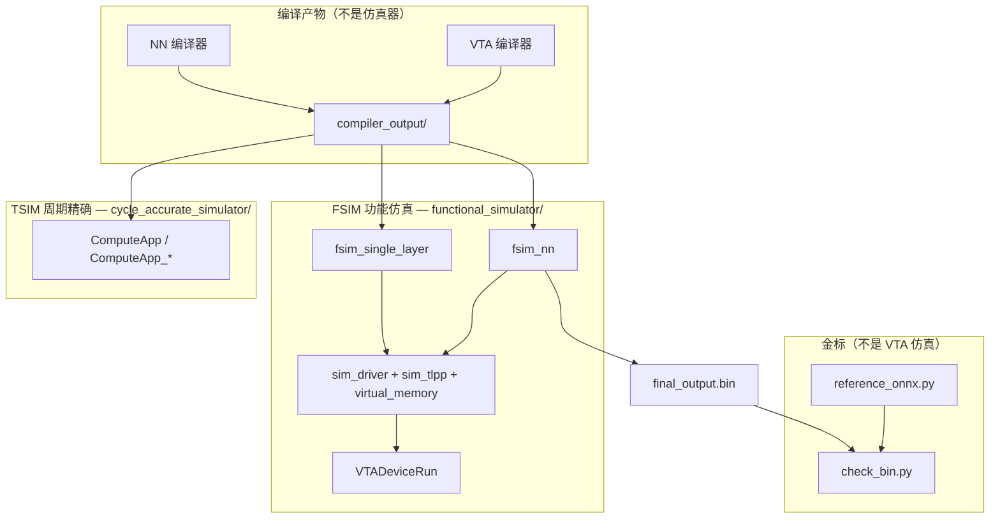
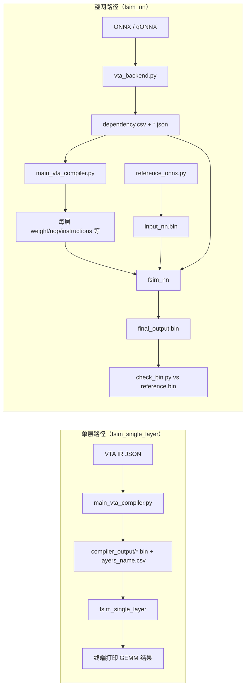
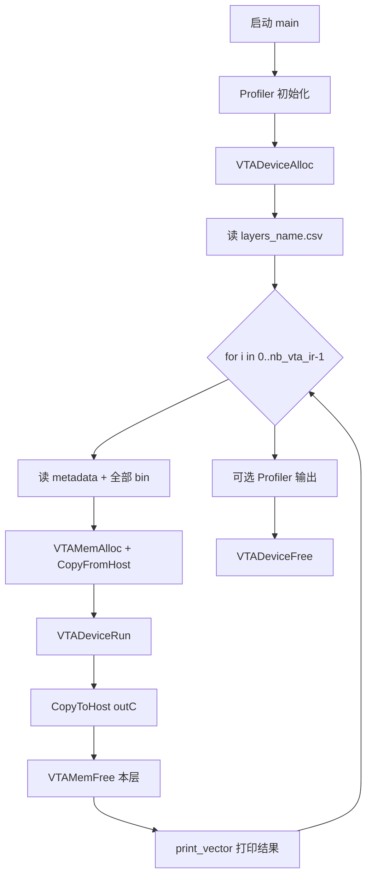
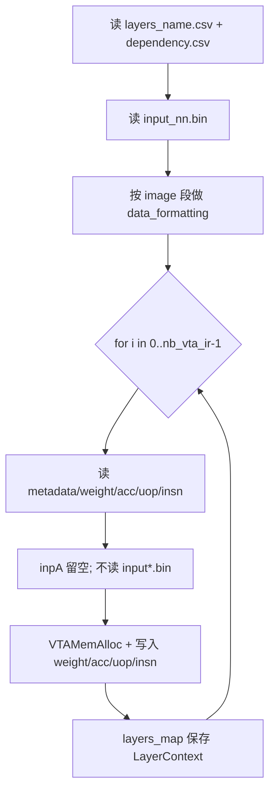
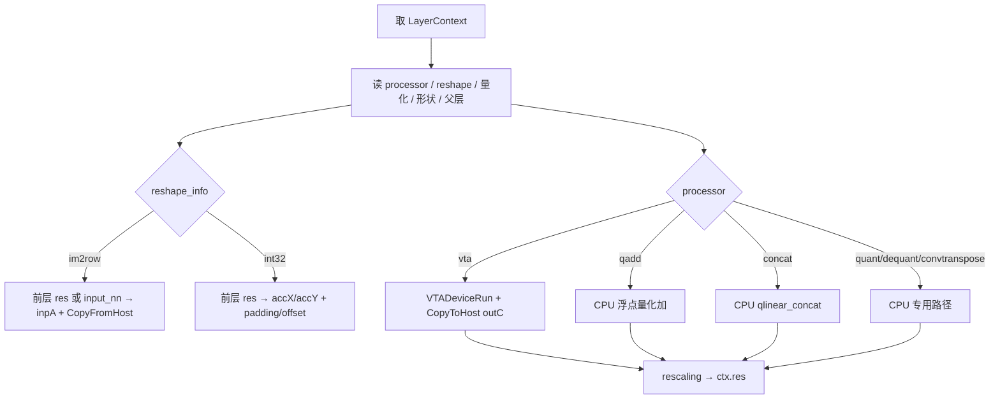

# `fsim_nn` 与 `fsim_single_layer` 详解

本文说明 standalone-vta 中两个 **功能仿真（Functional Simulation, FSIM）** 可执行文件的区别、各自依赖的 `compiler_output/` 产物，以及从编译到运行的完整流程。

源码位置：

| 可执行文件 | 源文件 | Makefile 目标 |
|------------|--------|----------------|
| `build/fsim_single_layer` | `src/simulators/functional_simulator/src/fsim_single_layer.cc` | `make build/fsim_single_layer` / `make execute` |
| `build/fsim_nn` | `src/simulators/functional_simulator/src/fsim_nn.cc` | `make build/fsim_nn` / `make nn_execute` |

工作目录约定：两个程序均在 **`src/simulators/functional_simulator/`** 下运行，通过相对路径 `../../../compiler_output/` 读取编译产物（即仓库根目录下的 `compiler_output/`）。

---

## 0. 仿真器全景（为何名字很多？）

项目里容易把 **目录名、旧可执行名、新可执行名、库文件** 当成多个仿真器。实际上可按三层理解：



| 名称 | 是什么 | 备注 |
|------|--------|------|
| **`vta_simulator`** | 旧可执行文件名 | 已拆为 `fsim_single_layer` / `fsim_nn`；部分 README 仍写旧名 |
| **`functional_simulator`** | C++ FSIM **工程目录** | 不是第三个 exe；内含两个 main + 共享核心 |
| **`sim_driver.cc`** | VTA 指令执行 **核心库** | `VTADeviceRun()`；被两个 fsim 可执行文件链接 |
| **`fsim_single_layer` / `fsim_nn`** | 两个 **入口程序** | 同一引擎，不同编排（单层 vs 整网） |
| **`build/functional_simulator`** | Makefile 中 `make all` 目标 | **无有效链接规则**，请勿使用 |
| **TSIM** | Chisel/Scala 周期模型 | 与 FSIM 并列，非替代关系 |
| **`reference_onnx.py`** | ONNX 金标 | 不参与 VTA 指令仿真 |

**`fsim_nn` 与 `vta_simulator` 的关系：** `fsim_nn` 可视为旧时代「整网功能仿真入口」的继任；`fsim_single_layer` 为「单层入口」。二者都不是独立于 `sim_driver` 的另一套硬件模型。

**选型口诀：** 算对、要快 → FSIM；看周期 → TSIM；对 ONNX → `fsim_nn` + `check`；只测 GEMM → `fsim_single_layer`。

---

## 1. 一句话对比

| 维度 | `fsim_single_layer` | `fsim_nn` |
|------|---------------------|-----------|
| **定位** | 单层 / 多层 **独立** VTA 算子验证 | **整网** 前向推理（VTA + CPU 混合） |
| **调度表** | 仅 `layers_name.csv` | `layers_name.csv` + **`dependency.csv`** |
| **输入** | 每层从磁盘读 `input{后缀}.bin` | 首层从 **`input_nn.bin`**，后续层 **链式** 使用前层 `res` |
| **层间关系** | 无（每层自带完整 A/X/Y） | 有（依赖名、im2row、padding、量化 scale） |
| **CPU 算子** | 不支持 | `qadd`、`concat`、`quant`、`dequant`、`convtranspose` 等 |
| **输出** | 打印到终端（`doPrint=true`） | 写 **`final_output.bin`**（默认不打印） |
| **典型 Makefile** | `make test_gemm` → `fsim_single_layer` | `make run` → `fsim_inference` → `fsim_nn` |
| **前置流水线** | 通常只需 **VTA 编译器** | 需要 **NN 编译器** + VTA 编译器 + `reference` 生成 `input_nn.bin` |

两者底层都调用同一套 VTA 仿真 API（`VTADeviceAlloc`、`VTAMemAlloc`、`VTADeviceRun`、TVM profiler 等），共享 `simulator_functions` 与 `external_lib/tvm`。

---

## 2. 在工具链中的位置



- **单层路径**：适合 `make test_gemm`、`make test_alu`、教程与 VTA IR 调试；不经过 NN 编译器。
- **整网路径**：适合 `make run`、真实量化算子图；`dependency.csv` 由 NN 编译器写出，详见 [`dependency_csv详解.md`](dependency_csv详解.md)。

---

## 3. `fsim_single_layer` 流程

### 3.1 设计意图

在 **已知每层输入二进制** 的前提下，按 `layers_name.csv` 列出的 VTA IR **逐个** 加载、执行、释放。每层是一次完整的「加载 → `VTADeviceRun` → 读回 `outC` → 释放 DRAM」，**不** 把上一层的输出当作下一层的输入。

适用于：

- 16×16 GEMM / ALU 等 `examples/` 测试（`make test_gemm`）
- 仅跑 VTA 编译器、手动或脚本准备好 `input*.bin` 的场景
- 与 TSIM 对照时，单层输入与金标一一对应

### 3.2 依赖文件

| 文件 | 是否必需 | 说明 |
|------|----------|------|
| `layers_name.csv` | 是 | `nb_vta_ir`、debug 标志、每层后缀（如空或 `QLinearConv1`） |
| `metadata{后缀}.csv` | 每层 | 块大小 BS，矩阵 A/X/Y/C 的行列与 square 标志 |
| `input{后缀}.bin` | 每层 | **从磁盘读取** 并做 `data_formatting` |
| `weight{后缀}.bin` | 每层 | 权重 |
| `accumulator{后缀}.bin` | 每层 | 累加器 X |
| `add_accumulator{后缀}.bin` | 每层 | 累加器 Y（可为空） |
| `uop{后缀}.bin`、`instructions{后缀}.bin` | 每层 | VTA 微操作与指令流 |
| `dependency.csv` | **否** | 整网调度表，单层 FSIM 不读 |
| `input_nn.bin`、`final_output.bin` | **否** | 整网输入/输出 |

`layers_name.csv` 示例（单层、空后缀，与 `make test_gemm` 一致）：

```csv
nb_vta_ir,1,False
0,,0
```

### 3.3 执行步骤（对应 `fsim_single_layer.cc`）



要点：

1. **Profiler**：启动时 `profiler_clear` / `profiler_debug_mode`；若 `layers_name.csv` 中 debug 为 `True`，结束时打印 `profiler_status` JSON。
2. **每层读入 `input{后缀}.bin`**：与 `fsim_nn` 在预加载阶段 **不读** `input*.bin`、运行时再链式填充 `inpA`/`accX` 不同。
3. **`doPrint = true`**：每层执行后在 stdout 打印 `RESULT LAYER i` 与向量内容。
4. **内存生命周期**：每层执行完立即 `VTAMemFree`，设备在循环外只分配一次 `VTADeviceAlloc`。

### 3.4 如何编译与运行

在 `examples/` 目录（推荐）：

```bash
make fsim_compile_single_layer   # 等价：cd functional_simulator && make build/fsim_single_layer
make fsim_single_layer           # 等价：cd functional_simulator && make -s execute
# 日志：log_output/fsim_report.txt
```

或手动：

```bash
cd src/simulators/functional_simulator
make build/fsim_single_layer
./build/fsim_single_layer
```

完整 GEMM 冒烟：`cd examples && make test_gemm`（见 [`MAKE_TEST_GEMM_cn.md`](MAKE_TEST_GEMM_cn.md)）。

---

## 4. `fsim_nn` 流程

### 4.1 设计意图

模拟 **整网前向**：按 `dependency.csv` 的 **执行顺序** 遍历所有节点（`nb_steps`），对 VTA 层调用 `VTADeviceRun`，对 CPU 层在主机上完成量化加法、拼接、量化/反量化、ConvTranspose 等，并在层间做 **im2row / int32 整形、padding、zero-point 与 rescale**，最终将最后一层结果写入 `final_output.bin`，供 `check_bin.py` 与 `reference.bin` 比对。

适用于：

- `make run` / `make fsim_inference` / `make compile_and_run`
- 含 `QLinearAdd`（`qadd`）、多分支、`QuantizeLinear` 等混合处理器的 ONNX 图

### 4.2 依赖文件

| 文件 | 是否必需 | 说明 |
|------|----------|------|
| `dependency.csv` | 是 | `nb_steps`、执行顺序、`image`/`output` 段、每层 processor/reshape/量化/形状/父层 |
| `layers_name.csv` | 是 | 仅列出 **VTA IR 层**（`nb_vta_ir`），用于预加载权重与指令 |
| `input_nn.bin` | 是 | 整网输入 int8 张量（通常由 `reference_onnx.py` 生成） |
| 每层 `metadata/weight/accumulator/.../uop/instructions` | VTA 层 | 与单层相同命名规则 |
| 每层 `input{后缀}.bin` | **预加载时不读** | 运行时用前层输出或 `input_nn` 填充 |
| `final_output.bin` | 写出 | 程序结束时由 `output_tensor()` 生成 |

`dependency.csv` 字段与 FSIM 列索引的对应关系见 [`dependency_csv详解.md`](dependency_csv详解.md) 第 14 节及 `fsim_nn.cc` 中对 `dependency_map` 的读取。

### 4.3 执行步骤（对应 `fsim_nn.cc`）

分为 **预加载**、**整网执行**、**收尾** 三阶段。

#### 阶段 A：预加载所有 VTA 层



- 所有 VTA 层的虚拟 DRAM **保持分配** 直到整网结束后再统一 `VTAMemFree`。
- `layers_map`：键为层名（如 `QLinearConv1`），值为 `LayerContext`。

#### 阶段 B：按 `dependency.csv` 执行顺序调度

从 `dependency_map` 的 `0..nb_steps-1` 行读取 **第 2 列** 得到 `execution_order`。对其中每个 `layer_name`：



**链式数据流（核心与单层 FSIM 的差异）：**

- 单输入、`reshape_info == "im2row"`：依赖层 `name_dep` 的 `ctx.res`（int8）或首层 `"image"` → `input_nn`，再 `reshape()` 得到 `inpA`。
- `reshape_info == "int32"`：将依赖层输出转为 `acc_dtype`，减 zero-point，按需 `pad_matrix`，写入 `accX`（双输入时还有 `accY`）。
- VTA 执行后：`rescaling(outC, scale, offsetC)` → `ctx.res`（int8），供后续层使用。

**CPU 处理器（`processor != "vta"`）：**

| processor | 行为概要 |
|-----------|----------|
| `qadd` | `(scaleA·X + scaleB·Y) / scaleC` 浮点运算后四舍五入到 int32 |
| `concat` | 多路 `res` 按通道维 `qlinear_concat` |
| `dequant` | 依赖层 int8 → float，存 `ctx.value` |
| `quant` | 依赖层 float → int32 `outC` |
| `convtranspose` | 读 float 权重/偏置 bin，对 `ctx.value` 做反卷积 |

不在 `layers_name.csv` 中的 CPU 层会在构建 `execution_order` 时 **自动创建** 空 `LayerContext`（见源码 “Auto-created context for CPU layer”）。

#### 阶段 C：写出最终结果

- 从 `dependency.csv` 的 `output` 段读取最终层名与 NCHW 形状。
- 取该层 `ctx.res`，调用 `output_tensor()` 写入 `compiler_output/final_output.bin`。
- 释放所有 VTA 层 DRAM 与 `VTADeviceFree`。
- 默认 **`doPrint = false`**，不打印向量（调试可改源码或开 `layers_name.csv` debug）。

### 4.4 如何编译与运行

在 `examples/` 目录：

```bash
make fsim_compile          # build/fsim_nn
make fsim_inference        # nn_execute，日志 fsim_report.txt
```

整网端到端（含 NN 编译与校验）：

```bash
make run ONNX_FILE=onnx/qlinearconv_debug.onnx
```

详见 [`MAKE_ONNX_RUN_cn.md`](MAKE_ONNX_RUN_cn.md)。

---

## 5. 源码级关键差异对照

| 逻辑 | `fsim_single_layer` | `fsim_nn` |
|------|----------------------|-----------|
| 读 `dependency.csv` | 无 | 有（`nb_steps`、执行顺序、每层元数据） |
| 读 `input_nn.bin` | 无 | 有 |
| 读 `input{后缀}.bin` | 每层加载时读取 | 预加载不读，运行时链式填充 |
| 层容器 | 循环内局部 `LayerContext` | `unordered_map<string, LayerContext>` |
| 执行循环 | `for (i < nb_vta_ir)` 按层表顺序 | `for (layer_name : execution_order)` 按依赖表顺序 |
| `VTADeviceRun` | 每层一次 | 仅 `processor == "vta"` 时 |
| 层间 `res` / rescaling | 无 | 有 |
| 写 `final_output.bin` | 无 | 有 |
| 默认打印结果 | 是 | 否 |

两文件中的 `LayerContext` 结构体字段相同，但 `fsim_nn` 额外使用 `res`（int8 链式结果）与 `value`（float 中间结果，用于 quant/dequant/convtranspose 路径）。

---

## 6. Makefile 与 examples 目标映射

在 `examples/Makefile` 中：

| 用户目标 | 编译 | 运行 | 说明 |
|----------|------|------|------|
| `fsim_compile_single_layer` | `build/fsim_single_layer` | — | 单层二进制 |
| `fsim_single_layer` | （`execute` 会按需编译） | `make execute` | 日志 → `log_output/fsim_report.txt` |
| `fsim_compile` | `build/fsim_nn` | — | 整网二进制 |
| `fsim_inference` | — | `make nn_execute` | 整网 FSIM |
| `test_gemm` / `test_alu` | `fsim_compile_single_layer` | `fsim_single_layer` | 无 NN 编译器 |
| `run` / `execute`（整网） | `fsim_compile`（在 `compile_and_run` 中） | `fsim_inference` | 含 `reference` + `check` |

在 `functional_simulator/Makefile` 中：

- `make execute` → 运行 `build/fsim_single_layer`
- `make nn_execute` → 运行 `build/fsim_nn`

---

## 7. 常见问题

### 7.1 能否用 `fsim_single_layer` 跑 ONNX 整网？

不能完整等价。整网需要 `dependency.csv` 的调度、链式 im2row、CPU 节点与 `input_nn.bin`；应使用 `fsim_nn` 或 `make fsim_inference`。

### 7.2 能否用 `fsim_nn` 只跑一层？

可以，若 NN 编译器生成的 `nb_steps=1` 且 `dependency.csv` 仅含一个 VTA 节点（如单层 `QLinearConv`）。此时仍会读 `input_nn.bin` 并写 `final_output.bin`，流程仍是整网程序，而非单层程序的「每层自带 input.bin」模型。

### 7.3 `layers_name.csv` 与 `dependency.csv` 如何分工？

- **`layers_name.csv`**：列出有哪些 **VTA IR** 需要预加载二进制（个数 `nb_vta_ir`、后缀、debug）。
- **`dependency.csv`**：描述 **整网拓扑与执行顺序**（含 CPU 层、量化参数、张量形状、父层依赖）。

仅 VTA 编译、无 NN 编译时通常只有 `layers_name.csv`，足够驱动 `fsim_single_layer`。

### 7.4 工作目录不对导致找不到 `compiler_output`

两个程序都用 `current_path / ".."/ ".."/ ".."/ "compiler_output"`。必须从 **`functional_simulator/`** 目录运行（或通过 Makefile `cd $(FSIM_DIR)`），否则相对路径会指向错误位置。

### 7.5 与 TSIM 的关系

- `fsim_single_layer` 常与 `make test_gemm` 后的 **TSIM** `ComputeApp` 配对（同一套 `compiler_output` 单层 bin）。
- `fsim_nn` 用于 ONNX 整网数值验证，**不** 替代 TSIM；整网周期级仿真需另建 TSIM 用例。

---

## 8. 相关文档

| 文档 | 内容 |
|------|------|
| [`src/simulators/README_cn.md`](../src/simulators/README_cn.md) | FSIM / TSIM 总览与快速选型 |
| [`src/simulators/functional_simulator/README_cn.md`](../src/simulators/functional_simulator/README_cn.md) | FSIM 目录：编译、运行、输入文件 |
| [`MAKE_TEST_GEMM_cn.md`](MAKE_TEST_GEMM_cn.md) | `test_gemm` 与 `fsim_single_layer` 冒烟流程 |
| [`MAKE_ONNX_RUN_cn.md`](MAKE_ONNX_RUN_cn.md) | `make run` 与 `fsim_nn` 整网流程 |
| [`dependency_csv详解.md`](dependency_csv详解.md) | `dependency.csv` 各段字段与 FSIM 读法 |
| [`main_vta_compiler_cn.md`](main_vta_compiler_cn.md) | VTA 编译器输出的 bin/csv |
| [`nn_compiler_cn.md`](nn_compiler_cn.md) | NN 编译器如何生成 `dependency.csv` |
| [`README_cn.md`](../README_cn.md) | FSIM 快速命令表 |

---

## 9. 小结

- **`fsim_single_layer`**：面向 **VTA 算子级** 验证；每层独立输入文件；按 `layers_name.csv` 顺序执行；结果打印到终端；适合 GEMM/ALU 测试与 VTA 指令调试。
- **`fsim_nn`**：面向 **量化神经网络整网**；依赖 `dependency.csv` 调度 VTA 与 CPU；层间链式传递；读 `input_nn.bin`、写 `final_output.bin`；与 `reference_onnx.py` / `check_bin.py` 组成端到端数值闭环。

选择哪一个，取决于你是否已经完成 **NN 编译** 并需要 **跨层依赖与 CPU 后处理**：仅 VTA 二层编译 → 单层；ONNX/qONNX 整图 → 整网。
