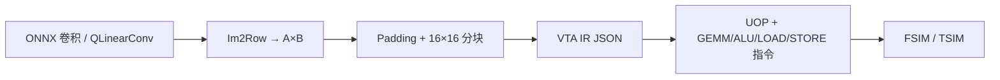
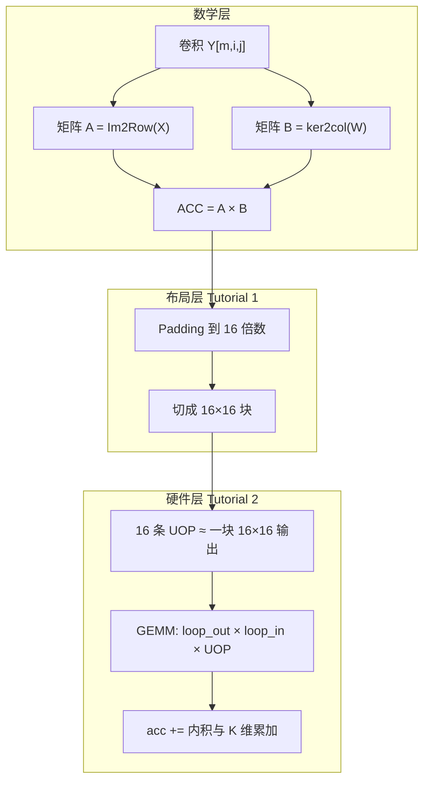

# GEMM、分块（Tile）与卷积原理说明

> 本文档用通俗语言串联 **卷积 → 矩阵乘 → 16×16 分块 → UOP/GEMM 指令** 的完整链路，并与本仓库 [Tutorial 1](../tutorials/tutorial1_data_definition.py)、[Tutorial 2](../tutorials/tutorial2_operations_definition.py) 及编译器两阶段对齐。  
> 指令位域细节见 [`VTA_ISA_REFERENCE_cn.md`](VTA_ISA_REFERENCE_cn.md)；NN/VTA 编译流程见 [`nn_compiler_cn.md`](nn_compiler_cn.md)、[`main_vta_compiler_cn.md`](main_vta_compiler_cn.md)。

---

## 目录

1. [鸟瞰：三层问题](#1-鸟瞰三层问题)
2. [卷积如何变成 GEMM（Im2Row）](#2-卷积如何变成-gemmim2row)
3. [为何要 Padding 与 16×16 分块](#3-为何要-padding-与-1616-分块)
4. [Tile / 分块矩阵乘原理](#4-tile--分块矩阵乘原理)
5. [VTA 硬件上一次 GEMM 算什么](#5-vta-硬件上一次-gemm-算什么)
6. [UOP：完整 16×16 块需要几条？](#6-uop完整-1616-块需要几条)
7. [Reduce 在哪里？需要单独指令吗？](#7-reduce-在哪里需要单独指令吗)
8. [GEMM 宏指令与三层循环](#8-gemm-宏指令与三层循环)
9. [Tutorial 2 示例：LeNet-5 第一层数字](#9-tutorial-2-示例lenet-5-第一层数字)
10. [整网：NN 编译器与 VTA 编译器分工](#10-整网nn-编译器与-vta-编译器分工)
11. [SRAM 装不下时：matrix_partitioning](#11-sram-装不下时matrix_partitioning)
12. [与教程、其它文档的对应](#12-与教程其它文档的对应)

---

## 1. 鸟瞰：三层问题

在 standalone-vta 里，「算一层卷积」被拆成三个层次，**不要混在一谈**：

| 层次 | 问题 | 谁解决 | 典型产物 |
|------|------|--------|----------|
| **数学** | 卷积和矩阵乘是否同一回事？ | Im2Row / Im2Col | 逻辑矩阵 A、B、ACC 的尺寸 |
| **数据布局** | 大矩阵如何切成硬件吃得下的块？ | `data_definition`（Tutorial 1） | padding、16×16 块列表 |
| **执行** | 块在 SRAM 上如何算、何时 LOAD/STORE？ | `operations_definition`（Tutorial 2）+ 编译器 | `uop.bin`、`instructions.bin` |



---

## 2. 卷积如何变成 GEMM（Im2Row）

### 2.1 卷积在算什么

输入 `X`：`(nc, nh, nw)`，卷积核 `W`：`(mc, nc, fh, fw)`，输出 `Y`：`(mc, mh, mw)`。

在输出通道 `m`、空间位置 `(i, j)`：

```
Y[m, i, j] = Σ_c Σ_u Σ_v  X[c, i·sh+u, j·sw+v] · W[m, c, u, v]
```

即：取一块 **感受野**（大小 `nc×fh×fw`），与第 `m` 个滤波器做点积。

### 2.2 Im2Row：每个输出位置一行

**核心：** 输出平面上每个 `(i,j)` 对应矩阵 **A 的一行**；每个滤波器 `m` 对应 **B 的一列**。

| 矩阵 | 形状 | 含义 |
|------|------|------|
| **A（INP）** | `(mh·mw) × (nc·fh·fw)` | 第 `r` 行 = 位置 `(i,j)` 的感受野展平 |
| **B（WGT）** | `(nc·fh·fw) × mc` | 第 `m` 列 = 第 `m` 个滤波器展平 |
| **ACC（OUT）** | `(mh·mw) × mc` | `ACC[r,m] = Y[m,i,j]` |

矩阵乘：

```
ACC = A × B
ACC[r, m] = Σ_k A[r,k] · B[k,m]   ← 与卷积点积完全相同
```

**本质：** Im2Row 只改 **数据排布（layout）**，不近似、不省略项。Tutorial 1 文件头有完整推导，见 [`tutorial1_data_definition.py`](../tutorials/tutorial1_data_definition.py) 第一节。

### 2.3 LeNet-5 第一层（C1）数字

| 量 | 值 |
|----|-----|
| 输入 | 1×32×32 |
| 核 | 6×1×5×5，stride=1，pad=0 |
| 输出特征图 | 28×28，6 通道 |
| **A** | **784 × 25**（784 个感受野，每个 25 维） |
| **B** | **25 × 6** |
| **ACC** | **784 × 6** |

---

## 3. 为何要 Padding 与 16×16 分块

### 3.1 与卷积等价性无关的 Padding

VTA 默认 `LOG_BLOCK=4` → **块边长 = 16**。矩阵行/列若不是 16 的倍数，编译器会在 **有效数据外补零**（`matrix_padding`），以便切整块。

Tutorial 1 中 C1 例子：

| 矩阵 | 原始 | 填充后 | 说明 |
|------|------|--------|------|
| A | 784×25 | **784×32** | 列方向补 7 列零 |
| B | 25×6 | **32×16** | 行、列均对齐到 16 |

补零列/行 **不参与有效点积**（与零相乘），有效区域内结果与未填充的 `A×B` 一致。详见 Tutorial 1 §2.5。

### 3.2 分块（Splitting）

填充后的矩阵按 **16×16** 切成子块（`matrix_splitting`）：

| 矩阵 | 块个数（C1 例） | 备注 |
|------|-----------------|------|
| A | **98** 个 INP 块 | 784/16 × 32/16 |
| B | **2** 个 WGT 块 | 32/16 × 16/16 |
| 输出 C | 按输出块布局 | 49 个「行块×16 列」等（见 Tutorial 2） |

这些块之后被 LOAD 进片上 **INP / WGT buffer**，由 GEMM 消费。

---

## 4. Tile / 分块矩阵乘原理

### 4.1 标准分块公式

大矩阵乘 `C = A × B`，将 A、B、C 按块划分：

```
C[i,j] = Σ_k  A[i,k] · B[k,j]
```

对每个固定输出块 `(i,j)`：

1. 累加器 **先置零**（或加载偏置）；
2. 对 K 方向每个中间块 `k`：**`C[i,j] += A[i,k] @ B[k,j]`**。

Tutorial 1 的 `block_matrix_multiply` 正是这样写的：

```python
acc = np.zeros_like(...)
for k in range(weight_block_col):
    acc += np.matmul(input_blocks[a_idx], weight_blocks[b_idx])
```

**Tile = 在 K 维上多次小块乘加，写到同一块输出上。**

### 4.2 C1 里 K 维与块的关系

- 填充后 A 有 **98** 个块（沿「输出行×输入列块」展开），B 有 **2** 个块（沿 K×输出通道）。
- 对某个输出块，往往要累加 **多个** `(A 块, B 块)` 对——对应 K 维上 25→32  padding 后的列块数。

不必手算每一个 `(a_idx,b_idx)`：第二阶段编译器根据 `matrix_partitioning` 的 **strategy** 生成 LOAD/GEMM 顺序；Tutorial 2 用 `loop_out=49`、`loop_in=16` 等宏指令参数覆盖整块扫描。

---

## 5. VTA 硬件上一次 GEMM 算什么

### 5.1 片上 buffer 里「一个索引」指什么

（与 [`VTA_ISA_REFERENCE_cn.md` §9](VTA_ISA_REFERENCE_cn.md) 一致，以下为常用 int8/ int32 语义。）

| Buffer | 一个 `sram_base` 索引单元 | 角色 |
|--------|---------------------------|------|
| **INP** | 16 个 int8（一块的 **一行**） | GEMM 左向量 |
| **WGT** | 16×16 个 int8（**整块权重**） | GEMM 右矩阵 |
| **ACC** | 16 个 int32（一块的 **一行累加**） | 写回目标 |

### 5.2 最小 MAC（一条 UOP 的数学）

对 ACC 中每个输出下标 `k`（0..15）：

```
acc[k] += Σ_{j=0}^{15}  inp[j] * wgt[j, k]
```

- **INP**：一行 16 维；
- **WGT**：整块 16×16；
- **内层 j 的求和** = 该输出点上的 **点积 / reduce**；
- **`+=`** = 与 ACC 已有值累加（跨 UOP、跨 loop 继续加）。

功能仿真实现见 `sim_driver.cc` 中 `RunGEMM` 的内层循环。

---

## 6. UOP：完整 16×16 块需要几条？

### 6.1 结论

| 目标 | 通常需要的 UOP 条数 |
|------|---------------------|
| 完整 **16×16 输出块**（一个 INP 块 × 一个 WGT 块） | **16 条** |
| 只算输出块中的 **一行** | **1 条** |
| 大矩阵 K 维多块累加 | 多条 UOP 或多次 `loop`，**同一 `dst_idx` 上 `+=`** |

### 6.2 原因

**一条 UOP** 只绑定：

- 一个 `src_idx` → **INP 的一行**；
- 一个 `wgt_idx` → **整个 WGT 块**；
- 一个 `dst_idx` → **ACC 的一行**（16 个 int32）。

要填满 16 行输出，就要 **16 组** `(dst_idx, src_idx, wgt_idx)`，放在 UOP cache 的连续条目里，由 GEMM 指令的 `[uop_bgn, uop_end)` 遍历。

### 6.3 UOP 32-bit 字段（GEMM）

| 字段 | 含义 |
|------|------|
| `dst_idx` | ACC 基索引 |
| `src_idx` | INP 基索引 |
| `wgt_idx` | WGT 基索引 |

宏指令通过 `dst/src/wgt_factor_in/out` 在 `loop_out` × `loop_in` 上递增这些索引，扫描所有块与行。

---

## 7. Reduce 在哪里？需要单独指令吗？

**需要 reduce，但没有名为 REDUCE 的 opcode。**

| Reduce 类型 | 发生位置 |
|-------------|----------|
| 内积（16 维） | 单条 UOP 内，`j=0..15` 求和后 `acc[k] += ...` |
| K 维 / 多块 | 多条 UOP 或 `loop_in` 对 **同一 ACC 槽** 反复 `+=` |
| 新输出块清零 | `GEMM` 且 **`reset=1`**，或先 `LOAD ACC` 装入偏置 |
| ReLU / 池化 | **ALU** 指令（Tutorial 2 的 MAX、ADD、SHR），不是 GEMM |

**`reset=1`**：开始一块新输出前清空 ACC（Tutorial 2 的 I1）。  
**`reset=0`**：在已有 ACC 上继续累加（K 维 tile、或加偏置之后）。

---

## 8. GEMM 宏指令与三层循环

GEMM 128-bit 指令 + UOP cache 的语义（[`operations_definition/README.md`](../src/compiler/vta_compiler/operations_definition/README.md)）：

```text
for i0 in range(loop_out):           # 外层：换输出块 / 行组
    for i1 in range(loop_in):        # 内层：K 维或其它分块
        for uop_idx in range(uop_bgn, uop_end):
            解码 UOP → (X, Y, Z)
            acc_idx = i0 * dst_factor_out + i1 * dst_factor_in + X
            inp_idx = i0 * src_factor_out + i1 * src_factor_in + Y
            wgt_idx = i0 * wgt_factor_out + i1 * wgt_factor_in + Z
            ACC[acc_idx] += GEMM(INP[inp_idx], WGT[wgt_idx])
```

| 参数 | 作用 |
|------|------|
| `loop_out` / `loop_in` | 外层/内层迭代次数 |
| `*_factor_out` / `*_factor_in` | 每次迭代 INP/WGT/ACC 索引步进 |
| `uop_bgn` / `uop_end` | UOP 表区间 **[begin, end)** |
| `reset` | 1=按 UOP 清空对应 ACC；0=纯累加 |

---

## 9. Tutorial 2 示例：LeNet-5 第一层数字

Tutorial 2 在 Tutorial 1 的矩阵上，演示 **如何用指令驱动硬件**（[`tutorial2_operations_definition.py`](../tutorials/tutorial2_operations_definition.py)）。

### 9.1 数据规模（与 Tutorial 1 一致）

| 项 | 值 |
|----|-----|
| 填充后 A | 784×32 → **98** 个 INP 块 |
| 填充后 B | 32×16 → **2** 个 WGT 块 |
| 输出 ACC 布局 | 784×16 有效通道，**49** 个输出块区域（loop 常用 49） |

### 9.2 执行阶段（摘要）

| 阶段 | 指令/操作 | 作用 |
|------|-----------|------|
| 0 | GEMM `reset=1`（I1） | 清空 ACC |
| 1 | LOAD INP/WGT/UOP（I2–I4） | DRAM → SRAM |
| 2 | GEMM（I5，UOP 1–2） | 分块乘加 |
| 3 | ALU ReLU（I6） | `max(0,x)` |
| 4 | ALU 池化（I7–I9） | ADD + SHR，28×28→14×14 |
| 5 | STORE OUT（I10） | SRAM → DRAM |

GEMM 阶段注释：`loop_out=49`、`loop_in=16`，用索引因子遍历块与行——对应 §4 的分块累加，而不是一条 UOP 算完整张量。

### 9.3 建议动手顺序

1. 运行 `python3 tutorials/tutorial1_data_definition.py` — 看 Im2Row 尺寸与分块块数。  
2. 阅读 Tutorial 2 脚本中 `insn_buffer` / `uop_buffer` 与伪代码 `insn_GEMM`。  
3. 需要 bin 时按脚本末尾说明生成 `uop.bin`、`instructions.bin` 并用 FSIM 验证。

---

## 10. 整网：NN 编译器与 VTA 编译器分工

| 阶段 | 入口 | 对「卷积/GEMM/tile」做什么 |
|------|------|---------------------------|
| **NN 编译器** | `vta_backend.py` | QLinearConv → VTA IR：`GEMM: [OUT,INP,WGT]`、`LOAD`/`STORE`、`STRATEGY`；写 **原始形状** 的 weight/acc bin |
| **VTA 编译器** | `main_vta_compiler.py` | Im2Row 已在 IR 矩阵维度假设中；**padding、分块、partitioning、UOP/insn** |

整网执行时，`fsim_nn` 在层间对上一层的 `res` 做 **im2row / reshape / scale**（见 [`fsim_nn与fsim_single_layer_cn.md`](fsim_nn与fsim_single_layer_cn.md)），再作为下一层 INP。

**下一层不会从「OUT buffer」继续算**——本层 `STORE` 写 DRAM，下一层 `LOAD INP`。

---

## 11. SRAM 装不下时：matrix_partitioning

当逻辑矩阵块数超过 INP/WGT/ACC 片上容量时，`isOverfitting=True`，编译器选用 **STRATEGY 1–4**（见 [`main_vta_compiler_cn.md` §阶段 4](main_vta_compiler_cn.md)）：

| 策略 | 思路（简述） |
|------|----------------|
| 1 | 按 K 等维简单分步加载计算 |
| 2 | 矩形 **tile**，在 tile 内再对 K 分块 |
| 3 | 双矩阵 / 双 ACC 类运算 |
| 4 | 纯 ALU |

输出是 **step 列表**：每步加载哪些 A/B/X 块、执行哪些 GEMM/ALU、STORE 哪些块。Tile 原理不变，只是 **多步** 才能算完大层。

---

## 12. 与教程、其它文档的对应

| 主题 | 文档 / 代码 |
|------|-------------|
| Im2Row 数学 + padding + 分块验证 | [Tutorial 1](../tutorials/tutorial1_data_definition.py)、[`tutorial1_data_definition_cn.ipynb`](../tutorials/tutorial1_data_definition_cn.ipynb) |
| UOP/insn、GEMM/ReLU/池化流水线 | [Tutorial 2](../tutorials/tutorial2_operations_definition.py)、[`tutorial2_operations_definition_cn.ipynb`](../tutorials/tutorial2_operations_definition_cn.ipynb) |
| 教程索引 | [`tutorials/README_cn.md`](../tutorials/README_cn.md) |
| ISA、buffer、依赖位 | [`VTA_ISA_REFERENCE_cn.md`](VTA_ISA_REFERENCE_cn.md) |
| 硬件 `LOG_BLOCK`、位宽 | [`vta_config_cn.md`](vta_config_cn.md) |
| ONNX → VTA IR | [`nn_compiler_cn.md`](nn_compiler_cn.md) |
| IR → 指令与 partitioning | [`main_vta_compiler_cn.md`](main_vta_compiler_cn.md) |
| 整网 FSIM | [`fsim_nn与fsim_single_layer_cn.md`](fsim_nn与fsim_single_layer_cn.md) |

---

## 附录：一张图串起 Conv → Tile → UOP



**记住三句话：**

1. **卷积 ≡ Im2Row 后的矩阵乘**（有效区域内）。  
2. **Tile = 对大矩阵的 A/B/C 分块，输出块上对 K 做 `+=`。**  
3. **一块 16×16 输出 ≈ 16 条 UOP；reduce 在 `+=` 里，不靠单独 REDUCE 指令。**
