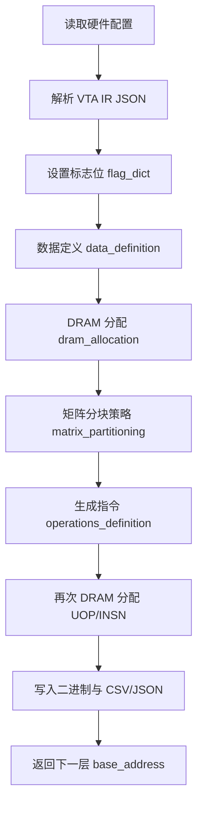

# `main_vta_compiler.py` 工作流程说明

本文档通俗介绍 VTA 编译器入口文件 [`main_vta_compiler.py`](../src/compiler/vta_compiler/main_vta_compiler.py) 的完整工作流程：它做什么、输入输出是什么、内部按什么顺序执行。

---

## 1. 它是什么？

`main_vta_compiler.py` 是 **VTA 编译器的总控程序**（第二阶段编译）。

在整条工具链里，它的位置大致是：

```
ONNX 模型  →  NN 编译器  →  VTA IR (JSON)  →  main_vta_compiler.py  →  二进制 + 指令  →  仿真器
                                              ↑ 本文档讲的就是这里
```

**一句话概括：** 读入一份描述「要算什么、用哪些矩阵」的 JSON（VTA IR），结合硬件配置，生成 VTA 加速器能直接执行的 **指令流、微操作（UOP）、DRAM 地址布局** 和 **二进制数据文件**。

---

## 2. 输入与输出

### 2.1 输入

| 输入 | 说明 |
|------|------|
| `vta_config_dict` | 硬件配置，通常来自 `config/vta_config.json`（块大小、数据类型、SRAM 容量等） |
| `operations_dict` | VTA IR，描述本层的矩阵、加载、计算、存储 |
| `base_address` | DRAM 起始物理地址（多层编译时逐层递增） |
| `dram_offset` | 物理地址与逻辑地址的偏移 |

命令行示例（来自 `make vta_compiler`）：

```bash
python main_vta_compiler.py \
  True \                          # debug
  True \                          # summary
  True \                          # dram_json（是否生成 dram_state.json）
  config/vta_config.json \        # 硬件配置
  compiler_output/matmul_16x16.json   # VTA IR（可多个）
```

### 2.2 输出

编译结果写入 `standalone-vta/compiler_output/`，主要包括：

| 文件类型 | 示例文件名 | 用途 |
|----------|------------|------|
| 权重 | `weight*.bin` | 转置后的权重块 |
| 累加器 | `accumulator*.bin` | ACC 初始值 |
| 输入/输出 | `input*.bin`, `out_init.bin` | 输入与输出初始块 |
| 指令 | `instructions*.bin` | VTA 硬件指令 |
| 微操作 | `uop*.bin` | 微操作序列 |
| 元数据 | `metadata*.csv` | 矩阵维度信息 |
| 地址表 | `memory_addresses*.csv` | 各缓冲区 DRAM 地址 |
| 层汇总 | `layers_name.csv` | 多层编译时的层名与地址 |
| 可选 | `dram_state.json` | 供 Chisel 周期仿真用的完整内存快照 |

---

## 3. 总体流程（鸟瞰图）



可以把 `main()` 看成 **7 个连续阶段**：

1. **读配置** — 从 JSON 算出块大小、数据类型、SRAM 容量
2. **解析 IR** — 理解要做什么运算，设置各种 `flag`
3. **数据定义** — 读矩阵、分块、填充
4. **DRAM 分配（第一轮）** — 给 INP/WGT/ACC/OUT 等分配地址
5. **矩阵分块策略** — 决定数据如何分批搬进 SRAM
6. **指令生成** — 生成 insn + uop
7. **二进制化** — 写文件，可选生成 `dram_state.json`

---

## 4. 阶段详解

### 阶段 0：读取硬件配置（约第 40–55 行）

从 `vta_config_dict` 推导硬件约束：

```python
block_size = 2 ** LOG_BLOCK          # 例：LOG_BLOCK=4 → 16×16 块
inp_dtype  = 由 LOG_INP_WIDTH 决定   # 例：5 → int32
inp_buffer_size = 由 LOG_INP_BUFF_SIZE 等计算
```

这些参数贯穿后续所有模块，决定 **一块有多大、SRAM 能装多少块**。

当前默认配置（`config/vta_config.json`）要点：

| 配置项 | 值 | 含义 |
|--------|-----|------|
| `LOG_BLOCK` | 4 | 块大小 = 2⁴ = **16** |
| `LOG_INP_WIDTH` 等 | 5 | 数据宽度 = 2⁵ = **32 bit**（int32） |
| `LOG_INP_BUFF_SIZE` 等 | 17/20/17 | 各 SRAM 缓冲区容量（以块为单位换算） |

---

### 阶段 1：解析 VTA IR（约第 91–192 行）

VTA IR 是一份 JSON，以 16×16 矩阵乘为例：

```json
{
  "NAME": "",
  "MATRICES": {
    "A": [16, 16, "../compiler_output/input_16x16.bin"],
    "B": [16, 16, "../compiler_output/weight_16x16.bin"],
    "C": [16, 16, "output"]
  },
  "LOAD": { "INP": ["A"], "WGT": ["B"] },
  "GEMM": ["C", "A", "B"],
  "STORE": { "C": ["C"] }
}
```

编译器从中提取四块信息：

#### ① 矩阵清单 `MATRICES`

每个矩阵格式：`[行数, 列数, 文件路径或 "output"]`。

- 路径以 `.bin` 结尾 → 从文件读数据
- `"output"` → 表示这是输出矩阵

#### ② 加载操作 `LOAD`

告诉编译器哪些矩阵进哪个硬件缓冲区：

| LOAD 键 | 含义 | 对应缓冲区 |
|---------|------|------------|
| `INP` | 输入 | 输入 SRAM |
| `WGT` | 权重 | 权重 SRAM |
| `ACC` | 累加器 | 累加器 SRAM |
| `ACC` 第二项 | 第二个累加器 | ACC_BIS（矩阵加法时用） |

#### ③ 计算操作

- **`GEMM: [OUT, INP, WGT]`** — 矩阵乘：`OUT = INP × WGT`
- **`GEMM: [OUT, INP, 标量]`** — 标量乘：`OUT = INP × 常数`
- **`ALU: { OUT: [...] }`** — 激活、偏置等（ReLU、ADD_ACC 等）

#### ④ 存储操作 `STORE`

- `["C"]` — 存整个输出矩阵
- `[[[行索引, 步长], 循环次数], ...]` — 只存部分行（如池化后）

此阶段还会做 **维度校验**（如 INP 列数 = WGT 行数），并填充 `flag_dict`：

```python
flag_dict = {
    "doGemm": False,           # 是否做矩阵乘
    "doExpandBias": False,     # 偏置是否为 1×N 需广播
    "doMulConstant": False,    # 是否标量乘
    "doAlu": False,            # 是否 ALU 运算
    "doAddMatrix": False,      # 是否两矩阵相加
    "doLoadInp/Wgt/Acc": ...,  # 是否加载对应缓冲区
    "doStoreFullMatrix": ...,  # 是否存完整输出
}
```

可选 **`STRATEGY`**（1–4）指定 GEMM 分块策略。

---

### 阶段 2：数据定义 `DF.data_definition`（约第 206–218 行）

**做什么：** 把逻辑矩阵变成 VTA 能处理的 **块矩阵（block matrix）**。

主要步骤：

1. 从 `.bin` 读原始矩阵（A、B、X 累加器等）
2. 按 `block_size` 切分并 padding（不足一块补零）
3. 标量乘时把常数写入权重块
4. 偏置 1×N 时标记 `doExpandBias` 并扩展
5. 按 `STORE` 决定输出块哪些要写回 DRAM

**输出：**

| 变量 | 含义 |
|------|------|
| `A_blocks`, `B_blocks` | 输入、权重块列表 |
| `X_blocks`, `Y_blocks` | 累加器、第二累加器块 |
| `C_blocks` | 输出块 |
| `*_blocks_col` | 每行有多少块（布局用） |
| `metadata` | 矩阵维度，供写 CSV |

---

### 阶段 3：DRAM 分配（第一轮）（约第 222–238 行）

**做什么：** 在模拟 DRAM 里为各缓冲区 **排地址**。

```python
object_list = [
    ("INP", A_blocks),
    ("WGT", B_blocks),
    ("ACC", X_blocks),
    ("ACC_BIS", Y_blocks),
    ("OUT", C_blocks),
    ("UOP", [], 4)   # 先占位，后面再填
]
```

`dram_allocation` 会：

- 按 4 KiB 页对齐
- 算物理地址与逻辑地址
- 返回 `base_addresses_list` 和更新后的 `base_address`

---

### 阶段 4：矩阵分块策略 `MP.matrix_partitioning`（约第 242–274 行）

**为什么需要：** VTA 的 SRAM 有限，大矩阵不能一次全部载入，必须 **分批计算**。

流程简述：

1. 统计各矩阵块数（`nb_A`, `nb_B`, `nb_X`, `nb_C`）
2. 把 `STORE` 里的行索引转成 **块索引** `idx_to_store`
3. 判断是否会 **溢出 SRAM**（`isOverfitting`）
4. 按运算类型选策略：
   - **CASE 1/2**：GEMM（有/无溢出）
   - **CASE 3**：双矩阵运算
   - **CASE 4**：纯 ALU

**输出 `strategy`：** 一个「计算步骤」列表。每一步大致包含：

```
([要加载的 A 块], [B 块], [X 块], [SRAM 中 ACC 状态], [写回 DRAM 的块], [输出块], [本步 ALU 操作])
```

可以理解为 **执行计划**：第 1 步加载哪些块、算什么、存哪里；第 2 步……直到完成。

---

### 阶段 5：指令生成 `OP.operations_definition`（约第 278–285 行）

**做什么：** 把 `strategy` 翻译成 VTA 硬件能执行的 **二进制指令**。

流程：

1. **Reset 序列** — 初始化
2. **逐步生成** — 对 `strategy` 每一步生成 load/compute/store 指令
3. **Termination 序列** — 结束

用 **信号量** 协调 LOAD ↔ COMPUTE ↔ STORE 的流水线顺序。

**输出：**

- `insn_buffer` — 指令列表（ctypes 结构体）
- `uop_buffer` — 微操作列表

---

### 阶段 6：DRAM 分配（第二轮）（约第 288–298 行）

UOP 和 INSN 的大小在生成指令前未知，所以 **第二轮** 再分配：

```python
object_list = [("UOP", uop_buffer), ("INSN", insn_buffer)]
```

并更新 `base_addresses_list` 中 UOP、INSN 的地址。

---

### 阶段 7：二进制化与元数据（约第 301–443 行）

把内存中的数据结构 **落盘**：

| 写入内容 | 注意点 |
|----------|--------|
| `B_blocks` | **先 transpose 再写**（硬件布局要求） |
| `X_matrix`, `Y_matrix` | 原始累加器矩阵 |
| `insn_buffer`, `uop_buffer` | 逐条写入二进制 |
| `metadata*.csv` | 矩阵 type/rows/columns |
| `memory_addresses*.csv` | 各缓冲区物理/逻辑地址 |

若 `dram_json=True`，还会构建 `dram_state_dictionary`：每个缓冲区的物理地址 + 十六进制数值，最后写入 `dram_state.json`，供 Chisel 周期仿真使用。

---

### 阶段 8：调试摘要与返回值（约第 447–473 行）

开启 `debug` 或 `summary` 时打印：

- 矩阵名、IR 片段、`flag_dict`
- 是否 SRAM 溢出、选用策略
- 生成多少 steps / UOPs / instructions

**返回值：**

```python
return updated_base_address, name, nb_steps, nb_uop, nb_insn, dram_state_dictionary
```

多层编译时，下一层从 `updated_base_address` 继续分配，避免地址冲突。

---

## 5. 命令行入口 `__main__`（约第 481–563 行）

作为脚本直接运行时：

1. 解析至少 6 个参数（debug、summary、dram_json、config、至少 1 个 VTA IR JSON）
2. **循环编译** 每个 JSON 文件
3. 累加 steps/uop/insn 统计
4. 写 `layers_name.csv`（每层名与最后 DRAM 地址）
5. 可选写 `dram_state.json`

典型调用链（见 [`MAKE_TEST_GEMM_cn.md`](../MAKE_TEST_GEMM_cn.md)）：

```
make test_gemm → make vta_compiler → main_vta_compiler.py
```

---

## 6. 用 16×16 GEMM 串一遍

假设已生成 `input_16x16.bin`、`weight_16x16.bin`，VTA IR 为 `matmul_16x16.json`：

| 步骤 | 发生的事 |
|------|----------|
| 1 | 读配置：`block_size=16`，类型 int32 |
| 2 | 解析 IR：`doGemm=True`，`doLoadInp/Wgt=True`，`doStoreFullMatrix=True` |
| 3 | 读 16×16 的 A、B，各切成 1 个 16×16 块 |
| 4 | DRAM 分配 INP、WGT、OUT 等区域 |
| 5 | 1×1 块不溢出 SRAM，strategy 通常只有 1 步 |
| 6 | 生成 load → GEMM → store 的 insn/uop |
| 7 | 写 `weight*.bin`（转置）、`instructions*.bin`、`uop*.bin` 等 |
| 8 | 返回，供 FSIM/TSIM 读取执行 |

---

## 7. 模块依赖关系

```
main_vta_compiler.py
├── utils/configuration          # 数据类型、缓冲区大小
├── utils/json_parser            # 读 JSON
├── toolbox/alu_operations       # 展开 ALU 操作到块级
├── toolbox/matrix_to_block_index # 行索引 → 块索引
├── toolbox/sort_idx_to_store    # 排序待存储块
├── data_definition/             # 矩阵读入与分块
├── dram_allocation/             # DRAM 地址布局
├── matrix_partitioning/         # 分块计算策略
└── operations_definition/       # insn/uop 生成
```

---

## 8. 小结

| 概念 | 通俗理解 |
|------|----------|
| **VTA IR** | 本层「算什么」的说明书（JSON） |
| **block_size** | 硬件一次处理的最小方块边长（通常 16） |
| **flag_dict** | 本层要做哪些事的开关集合 |
| **strategy** | 大矩阵装不进 SRAM 时的分批计算计划 |
| **insn / uop** | 给 VTA 核的执行命令与微操作 |
| **dram_allocation** | 各数据在模拟内存里的地址表 |

`main_vta_compiler.py` 本身不实现具体算法，而是 **编排** 上述模块：解析 IR → 准备数据 → 规划内存与分块 → 生成指令 → 输出仿真器所需的全套文件。

---

## 相关文档

- [`MAKE_TEST_GEMM_cn.md`](../MAKE_TEST_GEMM_cn.md) — `make test_gemm` 端到端流程
- [`config/vta_config.json`](../config/vta_config.json) — 默认硬件配置
- [`compiler_output/matmul_16x16.json`](../compiler_output/matmul_16x16.json) — 16×16 GEMM 示例 VTA IR
