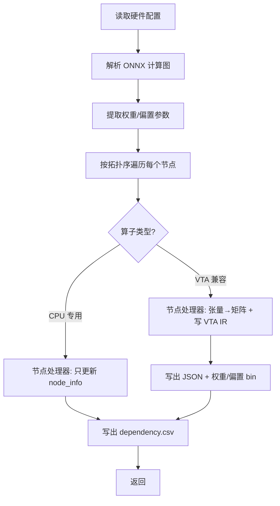
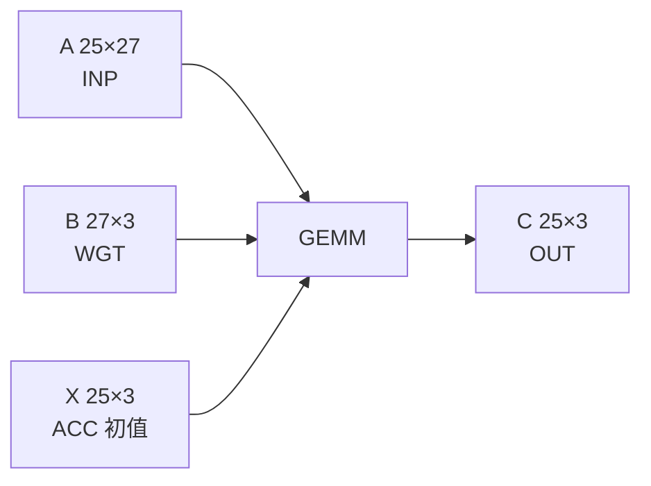
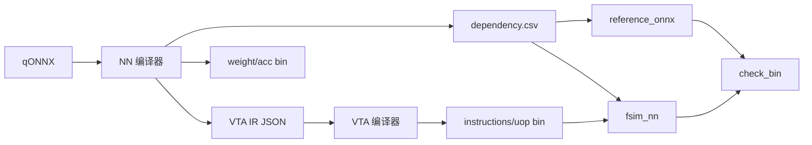

# NN 编译器（第一阶段）工作流程说明

本文档通俗介绍 **NN 编译器**（第一阶段编译）的完整工作流程。入口文件为 [`vta_backend.py`](../src/compiler/nn_compiler/vta_backend.py)，负责将 **量化 ONNX 模型（qONNX）** 转换为 **VTA IR（JSON）** 及配套的权重/偏置二进制，供第二阶段 VTA 编译器使用。

---

## 1. 它是什么？

NN 编译器是 standalone-vta 工具链的 **第一阶段编译**，也常被称为 **VTA Backend**。

在整条流水线中的位置：

```
qONNX 模型  →  vta_backend.py (NN 编译器)  →  VTA IR (JSON)  →  main_vta_compiler.py  →  仿真器
              ↑ 本文档讲的就是这里
```

**一句话概括：** 读入一个量化 ONNX 计算图，逐节点分析算子类型，把卷积等运算 **改写成 GEMM 矩阵乘**，生成每层一份 VTA IR JSON，并写出权重、偏置等原始二进制，同时记录整网的 **执行顺序与层间依赖**。

与第二阶段的分工：

| 阶段 | 入口 | 输入 | 输出 |
|------|------|------|------|
| **第一阶段（本文）** | `vta_backend.py` | qONNX | VTA IR JSON、`dependency.csv`、权重/偏置 bin |
| **第二阶段** | `main_vta_compiler.py` | VTA IR JSON | 指令流、UOP、块布局 bin、DRAM 地址表 |

详见 [`main_vta_compiler_cn.md`](main_vta_compiler_cn.md)。

---

## 2. 输入与输出

### 2.1 输入

| 输入 | 说明 |
|------|------|
| `vta_config_dict` | 硬件配置，来自 `config/vta_config.json`（数据类型、块大小等，与第二阶段共用） |
| `onnx_model_path` | 量化 ONNX 模型路径（如 `examples/onnx/qlinearconv_debug.onnx`） |
| `doExpandBiasAtCompilation` | 是否在编译期将 1×N 偏置扩展为与输出同尺寸的矩阵 |

命令行示例（来自 `make nn_compiler`）：

```bash
python vta_backend.py \
  True \                          # debug（解析与统计信息）
  True \                          # doExpandBiasAtCompilation
  config/vta_config.json \        # 硬件配置
  onnx/qlinearconv_debug.onnx     # qONNX 模型
```

### 2.2 输出

结果写入 `standalone-vta/compiler_output/`，主要包括：

| 文件类型 | 示例文件名 | 用途 |
|----------|------------|------|
| VTA IR | `QLinearConv1.json` | 第二层 VTA 编译器的输入 |
| 依赖表 | `dependency.csv` | 整网执行顺序、量化参数、层间依赖（reference/FSIM 读取） |
| 权重 bin | `QLinearConv1weight_27x3.bin` | ker2col 后的权重矩阵（原始布局） |
| 偏置 bin | `QLinearConv1accumulator_25x3.bin` | 偏置/累加器初值（原始布局） |
| 占位 bin | `Relu3accumulator_....bin` | ReLU/Pool 等层的 ACC 占位（随机生成，运行时由上一层输出覆盖） |

**注意：** 此阶段 **不生成** VTA 指令（`instructions*.bin`）、块布局 bin 或 DRAM 地址表——那些由第二阶段 `main_vta_compiler.py` 产生。

---

## 3. 总体流程（鸟瞰图）



`vta_backend()` 可概括为 **5 个连续阶段**：

1. **读配置** — 确定 inp/wgt/acc 数据类型
2. **解析 ONNX** — 形状推断、构建图字典、提取 initializer
3. **逐节点分发** — 按 `op_type` 调用对应节点处理器
4. **写 VTA IR** — 每个 VTA 层一个 JSON 文件
5. **写 dependency.csv** — 整网元数据与执行顺序

---

## 4. 阶段详解

### 阶段 0：读取硬件配置（约第 36–41 行）

从 `vta_config_dict` 推导数据类型（与 VTA 编译器共用同一套配置）：

```python
inp_dtype = conf.data_type(LOG_INP_WIDTH)   # 例：5 → int32
wgt_dtype = conf.data_type(LOG_WGT_WIDTH)
acc_dtype = conf.data_type(LOG_ACC_WIDTH)
```

NN 编译器主要用这些类型来 **读写权重/偏置 bin**；块大小（`LOG_BLOCK`）在第一阶段不直接参与分块，但在写 VTA IR 时会预设 `STRATEGY` 等字段供第二阶段使用。

---

### 阶段 1：解析 ONNX 计算图（约第 43–63 行）

调用两个解析函数：

#### ① `parse_onnx_to_dict` — 图结构

[`parser/parse_onnx_to_dict.py`](../src/compiler/nn_compiler/parser/parse_onnx_to_dict.py) 完成：

1. 用 `onnx.load` 加载模型
2. 运行 **形状推断**（`onnx.shape_inference.infer_shapes`），补全中间张量维度
3. 按拓扑序遍历每个 `graph.node`，提取：
   - `op_type`（算子类型）
   - `attributes`（kernel、stride、padding 等）
   - 输入/输出张量的 name 与 shape
4. 构建 **张量名 → 产生该张量的节点索引** 映射表 `dict_name_index`（图输入索引为 0）

返回的 `model_dict` 结构：

```python
{
  "model_name": "...",
  "inputs":  [{"name": "...", "shape": [...]}],
  "outputs": [{"name": "...", "shape": [...]}],
  "nodes":   [{"index": 1, "op_type": "QLinearConv", "attributes": {...}, ...}, ...]
}
```

#### ② `get_onnx_parameters` — 权重与偏置

从 ONNX 的 `initializer` 中提取所有常量张量（卷积核、偏置、量化 scale/zero_point 等），转为 NumPy 数组字典 `model_param`。

---

### 阶段 2：逐节点分发（约第 91–241 行）

编译器按 ONNX 图的 **拓扑顺序** 遍历 `compute_nodes`，对每个节点：

1. 判断是否在 VTA 兼容列表中
2. 构造 `node_info`（处理器类型、形状、量化参数、父层依赖等）
3. 按 `op_type` 调用对应 **节点处理器**
4. 若处理器返回非空 `vta_ir`，加入 `vta_ir_list`
5. 将 `node_info` 追加到 `execution_order`

#### VTA 兼容 vs CPU 分工

| 处理器 | 算子 | 是否生成 VTA IR | 说明 |
|--------|------|-----------------|------|
| **VTA** | `QLinearConv` | ✅ | 卷积 → Im2Col + GEMM |
| **VTA** | `QLinearMul` | ✅ | 逐元素乘常量 → MulConstant GEMM |
| **VTA** | `MaxPool` | ✅ | 最大池化 → ALU + 部分 STORE |
| **VTA** | `Relu` | ✅ | ReLU → ALU（MAX_IMM） |
| **CPU** | `QLinearAdd` | ❌ | 矩阵/偏置加法，由 FSIM C++ 执行 |
| **CPU** | `QuantizeLinear` / `DequantizeLinear` | ❌ | 量化/反量化 |
| **CPU** | `QLinearConcat` | ❌ | 张量拼接 |
| **CPU** | `ConvTranspose` | ❌ | 转置卷积 |

VTA 兼容列表定义在 `vta_backend.py` 第 71–79 行；不在列表中的算子目前仅 `pass`，不更新依赖。

#### 层命名规则

每个节点文件名：`{OpType}{index}`，例如第 1 个 QLinearConv → `QLinearConv1`。

#### 父层依赖追踪

[`parser/get_input_nodes.py`](../src/compiler/nn_compiler/parser/get_input_nodes.py) 根据 `dict_name_index` 追溯输入来自哪一层：

- 索引 `0` → 来自图输入，记为 `"image"`
- 其他 → 记为父层名，如 `"QLinearConv1"`

---

### 阶段 3：各节点处理器详解

#### 3.1 QLinearConv — 卷积 → GEMM

[`nodes/node_conv.py`](../src/compiler/nn_compiler/nodes/node_conv.py) 中的 `node_conv`：

**核心思想：** 把 NCHW 卷积改写成矩阵乘法 `C = A × B + bias`。

```
张量 Im2Col          权重 ker2col
  A (Ah × Aw_Bh)  ×  B (Aw_Bh × Bw)  =  C (Ah × Bw)
```

步骤概要：

1. 从节点输入解析 **激活张量 A**（NCHW）、**权重 B**（OC×IC×KH×KW）、**偏置**、量化 scale/zero_point
2. 读取卷积属性：kernel、stride、padding
3. 调用 `tensor_matrix_converter` 做 **Im2Col**（输入展平为矩阵 A）
4. 调用 `shape_data.ker2col` 把卷积核转为矩阵 B
5. 处理偏置：
   - `doExpandBiasAtCompilation=False` → 偏置保持 1×N，VTA 编译期广播（`doExpandBias`）
   - `doExpandBiasAtCompilation=True` → 编译期扩展为 Ah×Bw 矩阵
6. 生成 VTA IR 并 **写出权重/偏置 bin**

生成的 VTA IR 示例（单层 5×5 卷积）：

```json
{
  "NAME": "QLinearConv1",
  "MATRICES": {
    "A": [25, 27, "input"],
    "B": [27, 3, "../compiler_output/QLinearConv1weight_27x3.bin"],
    "X": [25, 3, "../compiler_output/QLinearConv1accumulator_25x3.bin"],
    "C": [25, 3, "output"]
  },
  "LOAD": { "INP": ["A"], "WGT": ["B"], "ACC": ["X"] },
  "GEMM": ["C", "A", "B"],
  "STORE": { "C": ["C"] },
  "STRATEGY": 2
}
```

矩阵维度含义（5×5 输入，3 通道，3×3 卷积，3 输出通道）：

| 矩阵 | 行 × 列 | 含义 |
|------|---------|------|
| A | 25 × 27 | 5×5 空间位置 × (3 通道 × 3×3 感受野) |
| B | 27 × 3 | ker2col 权重 |
| C | 25 × 3 | 输出特征图展平 |

`node_info` 中会记录 `processor: "vta"`、输入/输出 NCHW 形状、量化参数、父层列表等，供 `dependency.csv` 和 FSIM 使用。

#### 3.2 QLinearMul — 标量乘

`node_mulconstant`：输入张量与 **标量常量** 相乘，映射为 VTA 的 MulConstant GEMM：

```json
"GEMM": ["C", "A", 标量整数]
```

不写出权重 bin（标量直接写在 IR 里）。

#### 3.3 MaxPool — 最大池化

[`nodes/node_pool.py`](../src/compiler/nn_compiler/nodes/node_pool.py)：

- 输入视为 ACC 缓冲区中的矩阵 X（来自上一层 VTA 输出）
- 用 **ALU** 描述池化窗口内的 MAX 操作
- `STORE` 只写回部分行（降采样后的空间位置）
- 额外用 `random_raw_binary_generator` 生成 **占位 accumulator bin**（运行时会被真实中间结果覆盖）

#### 3.4 Relu — 激活

[`nodes/node_activation.py`](../src/compiler/nn_compiler/nodes/node_activation.py)：

- 纯 ALU 操作：`MAX_IMM`（与 0 取 max）
- 只需 LOAD ACC、ALU、STORE，无 GEMM
- 同样生成占位 accumulator bin

#### 3.5 QLinearAdd — CPU 加法

[`nodes/node_add.py`](../src/compiler/nn_compiler/nodes/node_add.py)：

- **不生成 VTA IR**
- 更新 `node_info`：`processor: "cpu"`，记录两个输入的量化参数
- 区分偏置加法（1×N）与矩阵加法（需 `accbis` 占位 bin）
- 实际计算在 FSIM 的 C++ CPU 路径完成

#### 3.6 其他 CPU 算子

[`nodes/node_cpu.py`](../src/compiler/nn_compiler/nodes/node_cpu.py) 处理：

- `quantizelinear` / 反量化
- `qlinearconcat`
- `convtranspose`

均只填充 `node_info`，不写 VTA IR。

---

### 阶段 4：写 VTA IR JSON（约第 244–271 行）

遍历 `vta_ir_list`，每个条目写一份 JSON：

```
compiler_output/QLinearConv1.json
compiler_output/QLinearConv2.json
...
```

若模型中没有任何 VTA 兼容节点，会写入一个临时的 `tempo.json` 占位（调试用途）。

**VTA IR 字段说明**（与 [`main_vta_compiler_cn.md`](main_vta_compiler_cn.md) 一致；**以 `QLinearConv1.json` 为例的逐项详解见第 6 节**）：

| 字段 | 含义 |
|------|------|
| `NAME` | 层名 |
| `MATRICES` | 逻辑矩阵及维度、数据来源 |
| `LOAD` | 加载到哪些硬件缓冲区 |
| `GEMM` / `ALU` | 计算操作 |
| `STORE` | 写回 DRAM 的方式 |
| `STRATEGY` | 可选，GEMM 分块策略编号 |

与手写 VTA IR（如 `matmul_16x16.json`）的区别：NN 编译器生成的 IR 中，矩阵 A 常标为 `"input"`（运行时由 FSIM 注入），权重/偏置指向本阶段写出的 bin 路径。

---

### 阶段 5：写 dependency.csv（约第 274–353 行）

[`dependency.csv`](../compiler_output/dependency.csv) 是整网的 **调度与元数据总表**，后续多个工具依赖它：

| 读取方 | 用途 |
|--------|------|
| `reference_onnx.py` | 获取输入图像尺寸，生成 `input_nn.bin` |
| `check_bin.py` | 获取输出张量形状，比对 `reference.bin` 与 `final_output.bin` |
| FSIM (`fsim_nn`) | 按执行顺序调度 VTA 层与 CPU 层 |

CSV 包含四段：

1. **层数** — `nb_steps`
2. **输入图像** — 首层输入的展平行/列（H×W 与 C）
3. **输出信息** — 最后一层的 NCHW 输出形状
4. **逐层详情** — 每层的：
   - 处理器（`vta` / `cpu`）
   - 量化参数（offset/scale A/B/U/V/C、rescaling）
   - 输入/输出 NCHW、kernel、stride、padding
   - 父层列表（依赖关系）

---

## 5. 关键转换：Im2Col 与 ker2col

NN 编译器把卷积「矩阵化」依赖 [`shape_data/shape_data.py`](../src/compiler/nn_compiler/shape_data/shape_data.py)：

### ker2col — 卷积核 → 矩阵 B

```
输入: K[OC, IC, KH, KW]
输出: B[IC×KH×KW, OC]   （每列对应一个输出通道的展平卷积核）
```

### Im2Col — 输入特征图 → 矩阵 A

由 `utils/tensor_matrix_converter.py` 完成：按卷积窗口在输入 NCHW 张量上滑动，每个输出空间位置对应 A 的一行。

### 为何这样做？

VTA 硬件本质是 **GEMM 加速器**。NN 编译器的职责就是把 ONNX 里的卷积、乘常量等算子 **降维** 成 VTA 能执行的矩阵乘 + ALU，第二层编译器再负责块切分、SRAM 调度与指令生成。

---

## 6. VTA IR 字段详解：以 `QLinearConv1.json` 为例

[`compiler_output/QLinearConv1.json`](../compiler_output/QLinearConv1.json) 是编译 `qlinearconv_debug.onnx`（5×5 输入、3 通道、3×3 卷积、same 填充、3 输出通道）后生成的 VTA IR。下面逐项解释用户最常问的三块：**`MATRICES`**、**`LOAD.ACC`**、**`STRATEGY`**。

### 6.1 从卷积到矩阵乘：数字从哪来？

ONNX 侧张量为 NCHW：`[1, 3, 5, 5]` → `[1, 3, 5, 5]`。NN 编译器用 [`im2row_matrix_dimension`](../src/compiler/utils/tensor_matrix_converter.py) 计算逻辑矩阵尺寸：

| 符号 | 含义 | 本例取值 |
|------|------|----------|
| `nc` | 输入通道数 | 3 |
| `nh`, `nw` | 输入高、宽 | 5, 5 |
| `fh`, `fw` | 卷积核高、宽 | 3, 3 |
| `mc` | 输出通道数 | 3 |
| `mh`, `mw` | 输出高、宽 | 5, 5 |

公式：

```
Ah  = mh × mw           = 5 × 5  = 25    （输出空间位置个数，Im2Col 行数）
Aw  = nc × fh × fw      = 3 × 9  = 27    （每个位置的感受野长度，GEMM 公共维 K）
Bw  = mc                = 3              （输出通道数，GEMM 列数）
```

计算语义：

```
C[25×3] = A[25×27] × B[27×3] + bias
```

对应 VTA 硬件上的 **GEMM**：`C = A × B`，偏置通过 **预加载 ACC** 实现累加初值。

---

### 6.2 `MATRICES` — 四个逻辑矩阵

`MATRICES` 描述本层 GEMM 涉及的 **四个二维矩阵**。每个条目格式为 **`[行数, 列数, 数据来源]`**：

```json
"MATRICES": {
  "A": [25, 27, "input"],
  "B": [27, 3, "../compiler_output/QLinearConv1weight_27x3.bin"],
  "X": [25, 3, "../compiler_output/QLinearConv1accumulator_25x3.bin"],
  "C": [25, 3, "output"]
}
```

#### 矩阵 A — 输入（INP）

| 字段 | 值 | 含义 |
|------|-----|------|
| 行 25 | `mh×mw` | 每个输出空间位置一行（Im2Col / Im2Row 展平） |
| 列 27 | `nc×fh×fw` | 该行上 3 通道 × 3×3 窗口内的所有激活值 |
| 来源 `"input"` | — | **不在 NN 编译阶段写死**；首层由 FSIM/`reference` 在运行时注入（`input_nn.bin`），中间层则来自上一层输出 |

在 VTA IR 命名中，A 对应硬件 **INP 缓冲区** 的数据。

#### 矩阵 B — 权重（WGT）

| 字段 | 值 | 含义 |
|------|-----|------|
| 行 27 | `nc×fh×fw` | ker2col 后权重矩阵的行维（与 A 的列维相同，才能相乘） |
| 列 3 | `mc` | 每个输出通道占一列 |
| 来源 `.bin` 路径 | — | NN 编译器已用 [`ker2col`](../src/compiler/nn_compiler/shape_data/shape_data.py) 写好 **`QLinearConv1weight_27x3.bin`** |

#### 矩阵 X — 累加器初值 / 偏置（ACC）

| 字段 | 值 | 含义 |
|------|-----|------|
| 行 25 | `Ah` | 与输出 C 行数相同（本例因 `EXPANDBIAS_AT_COMPILATION=True`，偏置在编译期 **广播扩展** 为 25 行） |
| 列 3 | `Bw` | 每个输出通道一个偏置值 |
| 来源 `.bin` 路径 | — | **`QLinearConv1accumulator_25x3.bin`**，存扩展后的偏置矩阵 |

若 `doExpandBiasAtCompilation=False`，X 常为 **`[1, 3, ...]`**（1×N 偏置），由第二阶段 VTA 编译器设置 `doExpandBias` 在硬件侧广播。

X 在 IR 里单独列出，但语义上是 **GEMM 的累加起点**（见 6.3 节），不是与 A 并列的「第二个输入乘子」。

#### 矩阵 C — 输出（OUT）

| 字段 | 值 | 含义 |
|------|-----|------|
| 行 25、列 3 | 与 GEMM 结果同形 | 卷积输出展平后的 `[空间位置 × 输出通道]` |
| 来源 `"output"` | — | 本层计算结果；第二阶段编译后写入 OUT 区 DRAM，再 `STORE` 或供下一层使用 |

#### 四矩阵与硬件缓冲区对应关系



| IR 名 | 硬件缓冲 | 角色 |
|-------|----------|------|
| A | INP SRAM | GEMM 左操作数（激活 Im2Col） |
| B | WGT SRAM | GEMM 右操作数（权重 ker2col） |
| X | ACC SRAM | 乘加 **起始累加值**（偏置） |
| C | OUT / ACC | GEMM 结果 |

---

### 6.3 `LOAD.ACC: ["X"]` — 把矩阵 X 载入累加器

```json
"LOAD": {
  "INP": ["A"],
  "WGT": ["B"],
  "ACC": ["X"]
}
```

`LOAD` 声明：执行本层计算前，应从 DRAM（或占位 bin）把哪些 **逻辑矩阵** 搬进哪些 **片上 SRAM**。

| LOAD 键 | 值 | 含义 |
|---------|-----|------|
| `INP` | `["A"]` | 加载输入矩阵 A → INP buffer |
| `WGT` | `["B"]` | 加载权重矩阵 B → WGT buffer |
| `ACC` | `["X"]` | 加载矩阵 **X** → **ACC buffer**（不是字母巧合：IR 里累加器矩阵就叫 X） |

**为何需要 LOAD ACC？**

VTA 上 GEMM 的语义是 **在累加器上累加**，而不是每次从 0 开始：

```
acc ← X          （LOAD ACC：装入偏置）
acc ← acc + A×B  （GEMM：逐块乘加）
C   ← acc        （STORE：写回输出）
```

因此对带偏置的 QLinearConv：

1. 先把 **偏置**（矩阵 X）载入 ACC；
2. 再算 `A×B` 并 **累加** 到 ACC；
3. 最后得到 **C = A×B + bias**。

若某层无偏置，X 可能是全零矩阵（或 1×N 零偏置），`LOAD ACC` 仍可能出现，表示累加从 0（或广播偏置）开始。

列表中的字符串 `"X"` 必须与 `MATRICES` 里的键名一致；第二阶段编译器据此解析维度与 bin 路径。

---

### 6.4 `STRATEGY: 2` — GEMM 分块策略编号

```json
"STRATEGY": 2
```

**含义：** 当逻辑矩阵太大、**装不进片上 SRAM**（`isOverfitting=True`）时，VTA 编译器 [`matrix_partitioning`](../src/compiler/vta_compiler/matrix_partitioning/matrix_partitioning.py) 用哪一种 **分批计算** 算法。编号 **1–4** 仅对 **GEMM / MulConstant** 且在溢出时生效。

| 编号 | 名称（代码注释） | 思路 |
|:----:|------------------|------|
| **1** | 逐输出块精细调度 | 偏向 **尽快算完 C 的一个元素/块**：按行加载 A、按列加载 B，适合 K 维较长、输出块较小的情形 |
| **2** | 区域分块（region tiling） | 把 C 划成 **矩形 tile**，在 tile 内对公共维 K 分块；在 INP/WGT/ACC 容量约束下尽量 **方形 tile**（[`strategy_2`](../src/compiler/vta_compiler/matrix_partitioning/gemm_strategies.py)） |
| **3** | （strategy_3） | 另一种 GEMM 溢出分块变体 |
| **4** | （strategy_4） | 另一种 GEMM 溢出分块变体 |

**谁写入、谁消费？**

- **写入：** [`node_conv.py`](../src/compiler/nn_compiler/nodes/node_conv.py) 对 **所有 QLinearConv** **硬编码** `"STRATEGY": 2`（与当前层是否真的会溢出无关，作为给第二阶段的 **建议/默认**）。
- **消费：** `main_vta_compiler.py` 读取该字段为 `strategy_selector`；若矩阵 **未溢出**，通常 **一步** 即可完成，策略 1 与 2 差别不大；若 **溢出**，则按 2 做区域 tiling 生成多步 `strategy` 与更多 insn/uop。

**本例 25×3 矩阵：** 远小于默认 SRAM 容量（见 [`vta_config_cn.md`](vta_config_cn.md)），第二阶段一般会判为 **不溢出**，`STRATEGY: 2` 更多是为 **更大卷积层** 预留；小层上几乎不改变结果，但保持与 NN 编译器设计一致。

若 IR **省略** `STRATEGY`，VTA 编译器默认使用 **1**。

---

### 6.5 与本 JSON 配套的其余字段（简要）

同文件中的其他键与上述三块一起构成完整一层：

```json
"NAME": "QLinearConv1",
"GEMM": ["C", "A", "B"],
"STORE": { "C": ["C"] }
```

| 字段 | 含义 |
|------|------|
| `NAME` | 层标识，与输出文件名前缀一致 |
| `GEMM` | `["输出", "输入", "权重"]` → **C = A × B**（累加初值由 LOAD ACC 的 X 提供） |
| `STORE` | 将结果矩阵 C 写回 DRAM；`["C"]` 表示 **整矩阵存储** |

---

### 6.6 小结对照表

| 你看到的 JSON | 一句话 |
|---------------|--------|
| `A: [25, 27, "input"]` | Im2Col 激活矩阵，25 个空间位置 × 27 维感受野 |
| `B: [27, 3, "...weight...bin"]` | ker2col 权重，27×3 |
| `X: [25, 3, "...accumulator...bin"]` | 扩展后的偏置，作为 ACC 初值 |
| `C: [25, 3, "output"]` | 卷积输出矩阵 |
| `LOAD ACC: ["X"]` | 先把偏置装进 ACC，再 GEMM 累加 |
| `STRATEGY: 2` | 大矩阵溢出时用 **区域分块** GEMM 策略（Conv 层默认写 2） |

---

## 7. 命令行入口 `__main__`（约第 406–432 行）

作为脚本直接运行时：

1. 校验 **4 个参数**：debug、doExpandBiasAtCompilation、config、onnx 路径
2. 调用 `vta_backend()`
3. 日志通常重定向到 `log_output/prompt_vta_backend.txt`

Makefile 中的典型调用（会先 `make clean` 清空输出目录）：

```bash
cd examples
make nn_compiler ONNX_FILE=onnx/qlinearconv_debug.onnx
```

完整 ONNX 流水线：

```bash
make run ONNX_FILE=onnx/qlinearconv_debug.onnx
# 等价于: nn_compiler → vta_compiler → reference → fsim_inference → check
```

详见 [`MAKE_ONNX_RUN_cn.md`](MAKE_ONNX_RUN_cn.md)。

---

## 8. 示例：单层 QLinearConv 走一遍

模型：`examples/onnx/qlinearconv_debug.onnx`（5×5 输入，3 通道，3×3 卷积，same 填充）

| 步骤 | 发生的事 |
|------|----------|
| 1 | 解析 ONNX：1 个 QLinearConv 节点，形状 [1,3,5,5] → [1,3,5,5] |
| 2 | 提取 3×3×3 权重、3 维偏置及量化参数 |
| 3 | Im2Col：A 为 25×27；ker2col：B 为 27×3 |
| 4 | 写 `QLinearConv1weight_27x3.bin`、`QLinearConv1accumulator_25x3.bin` |
| 5 | 写 `QLinearConv1.json`（字段含义见 **第 6 节**） |
| 6 | 写 `dependency.csv`（1 层、图像 25×3、执行顺序、量化元数据） |
| 7 | 第二阶段 `vta_compiler` 读取 JSON，生成指令与块布局 bin |

---

## 9. 模块依赖关系

```
vta_backend.py
├── utils/configuration              # 数据类型
├── utils/json_parser                # 读 vta_config.json
├── utils/random_raw_binary_generator # ReLU/Pool/Add 占位 bin
├── parser/
│   ├── parse_onnx_to_dict.py        # ONNX → 图字典 + 参数
│   └── get_input_nodes.py           # 层间依赖
├── nodes/
│   ├── node_conv.py                 # QLinearConv, QLinearMul
│   ├── node_pool.py                 # MaxPool
│   ├── node_activation.py           # Relu
│   ├── node_add.py                  # QLinearAdd (CPU)
│   └── node_cpu.py                  # Quantize/Concat/ConvTranspose (CPU)
├── shape_data/shape_data.py         # ker2col, expand_bias
└── utils/tensor_matrix_converter.py # Im2Col
```

---

## 10. 与第二阶段、仿真的衔接



- **NN → VTA**：`compiler_output/*.json` 被 `main_vta_compiler.py` 批量编译
- **NN → Reference**：`dependency.csv` 提供输入/输出形状
- **NN → FSIM**：`dependency.csv` 决定 VTA/CPU 层调度顺序；CPU 层读 `node_info` 中的量化参数

跳过 NN 编译器的捷径：直接使用预置 VTA IR（如 `make test_gemm` 复制 `matmul_16x16.json`），适用于只验证 VTA 编译器与仿真器。

---

## 11. 小结

| 概念 | 通俗理解 |
|------|----------|
| **qONNX** | 带 QLinear* 量化算子的 ONNX 模型 |
| **VTA IR** | 描述单层「加载什么、算什么、存什么」的 JSON |
| **Im2Col / ker2col** | 把卷积变成矩阵乘的两种变换 |
| **node_info** | 每层的完整元数据（形状、量化、依赖、处理器） |
| **dependency.csv** | 整网调度表，连接编译、参考、仿真 |
| **VTA vs CPU** | 能映射成 GEMM/ALU 的走 VTA，其余走 CPU 后处理 |

NN 编译器本身 **不生成硬件指令**，它的价值在于：**读懂 ONNX 图，做算子降级与矩阵化，产出第二阶段能消费的 VTA IR 和整网元数据**。

---

## 相关文档

- [`main_vta_compiler_cn.md`](main_vta_compiler_cn.md) — 第二阶段 VTA 编译器
- [`MAKE_ONNX_RUN_cn.md`](MAKE_ONNX_RUN_cn.md) — `make run` 端到端 ONNX 流水线
- [`MAKE_TEST_GEMM_cn.md`](../MAKE_TEST_GEMM_cn.md) — 跳过 NN 编译器的 GEMM 快速验证
- [`vta_config_cn.md`](vta_config_cn.md) — `vta_config.json` 各字段详解
- [`config/vta_config.json`](../config/vta_config.json) — 共用硬件配置
- [`examples/onnx/`](../examples/onnx/) — 调试用 qONNX 模型与生成脚本
