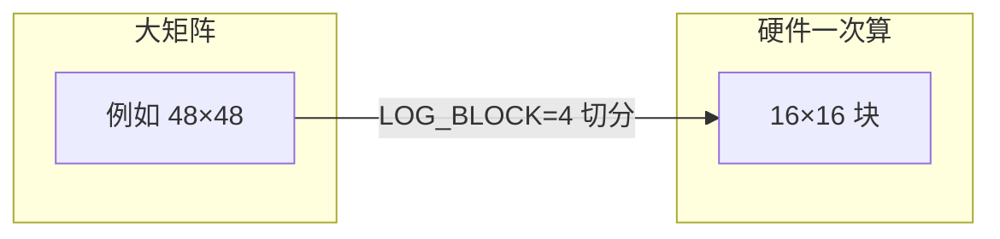

# `vta_config.json` 配置字段说明

本文档详细介绍 standalone-vta 的硬件配置文件 [`config/vta_config.json`](../config/vta_config.json) 中每个字段的含义、推导公式，以及在编译器与仿真器中的用途。

---

## 1. 这个文件是什么？

`vta_config.json` 描述 **VTA 加速器的硬件参数**（数据位宽、分块大小、片上 SRAM 容量、部署目标等）。它是整条工具链的 **单一配置源**：

| 使用者 | 读取方式 | 用途 |
|--------|----------|------|
| NN 编译器 `vta_backend.py` | 命令行第 3 个参数 | 确定权重/偏置 bin 的 NumPy 类型 |
| VTA 编译器 `main_vta_compiler.py` | 命令行参数 | 分块、SRAM 容量判断、DRAM 布局 |
| 功能仿真 FSIM | `vta_config.py` → C 宏 | 与硬件一致的 buffer 深度、GEMM 块大小 |
| 周期仿真 TSIM | 读 JSON（过滤部分字段） | Chisel 模型参数 |

Makefile 中通过 `$(CONFIG)/vta_config.json` 传给各阶段，**修改配置后需重新编译**（`make nn_compiler`、`make vta_compiler`、必要时重编 FSIM）。

---

## 2. 文件全貌

```json
{
  "TARGET" : "sim",
  "HW_VER" : "0.0.2",
  "LOG_INP_WIDTH" : 5,
  "LOG_WGT_WIDTH" : 5,
  "LOG_ACC_WIDTH" : 5,
  "LOG_BATCH" : 0,
  "LOG_BLOCK" : 4,
  "LOG_UOP_BUFF_SIZE" : 15,
  "LOG_INP_BUFF_SIZE" : 17,
  "LOG_WGT_BUFF_SIZE" : 20,
  "LOG_ACC_BUFF_SIZE" : 17
}
```

**命名约定：** 以 `LOG_` 开头的字段表示 **以 2 为底的对数**（log₂），实际数值为 `2^LOG_*`。这是 Apache TVM/VTA 上游沿用的写法，便于用移位表达硬件位宽与容量。

---

## 3. 字段总览

| 字段 | 默认值 | 类别 | 一句话 |
|------|:------:|------|--------|
| `TARGET` | `"sim"` | 部署 | 运行/综合目标平台 |
| `HW_VER` | `"0.0.2"` | 元数据 | 配置版本标识 |
| `LOG_INP_WIDTH` | 5 | 数据类型 | 输入（激活）元素位宽 → 2⁵ = 32 bit |
| `LOG_WGT_WIDTH` | 5 | 数据类型 | 权重元素位宽 |
| `LOG_ACC_WIDTH` | 5 | 数据类型 | 累加器元素位宽 |
| `LOG_BATCH` | 0 | 并行 | 批大小 → 2⁰ = 1 |
| `LOG_BLOCK` | 4 | 分块 | GEMM 块边长 → 2⁴ = **16** |
| `LOG_UOP_BUFF_SIZE` | 15 | SRAM | 微操作 cache 容量 → 2¹⁵ B |
| `LOG_INP_BUFF_SIZE` | 17 | SRAM | 输入 buffer 容量 → 2¹⁷ B |
| `LOG_WGT_BUFF_SIZE` | 20 | SRAM | 权重 buffer 容量 → 2²⁰ B |
| `LOG_ACC_BUFF_SIZE` | 17 | SRAM | 累加器 buffer 容量 → 2¹⁷ B |

---

## 4. 各字段详解

### 4.1 `TARGET` — 部署目标

**含义：** 指定 VTA 硬件要部署到哪种平台，或仅用于仿真。

**当前默认值：** `"sim"` — 本仓库以 **纯仿真** 为主，不绑定具体 FPGA 板卡。

**常见取值（上游 VTA / FSIM 支持）：**

| 值 | 说明 |
|----|------|
| `sim` | 仿真模式；不生成 `VTA_TARGET_*` 板级宏 |
| `pynq` | Xilinx Pynq 系列 |
| `de10nano` | Intel DE10-Nano |
| `ultra96` | Xilinx Ultra96 |
| `zcu104` | Xilinx ZCU104 |

在 [`pkg_config.py`](../src/simulators/functional_simulator/config/pkg_config.py) 中，`TARGET` 决定链接哪些驱动、FPGA 器件型号、AXI 位宽等。**standalone-vta 默认 `sim` 时，Python 编译器仍正常读 JSON，但 FSIM 不会套用某块 FPGA 的专用地址映射。**

**注意：** NN/VTA 两个 Python 编译器 **不读取** `TARGET`；它主要影响 FSIM 构建与（若做综合）bitstream 命名。

---

### 4.2 `HW_VER` — 硬件/配置版本

**含义：** 字符串形式的版本号，标识「与哪一版 VTA 硬件规格对齐」。

**当前默认值：** `"0.0.2"`

**在代码中的处理：**

- Python 编译器：**不使用** 该字段。
- TSIM 的 `BinaryReader.scala` 读取配置时会 **过滤掉** `TARGET` 与 `HW_VER`，只把数值型 LOG 参数交给硬件模型。

因此它更像 **文档/追溯用标签**；改它不会改变编译结果，除非下游工具显式校验版本。

---

### 4.3 `LOG_INP_WIDTH` / `LOG_WGT_WIDTH` / `LOG_ACC_WIDTH` — 数据位宽

**含义：** 输入（激活）、权重、累加器各自的 **元素位宽**（log₂）。

**推导：**

```
元素位宽（bit）= 2^LOG_*_WIDTH
```

**Python 编译器映射**（[`configuration.py`](../src/compiler/utils/configuration.py)）：

| LOG 值 | NumPy 类型 | 位宽 |
|:------:|------------|------|
| 3 | `np.int8` | 8 bit |
| 4 | `np.int16` | 16 bit |
| 5 | `np.int32` | 32 bit |
| 其他 | — | 报错「不支持」 |

**默认值 5 → 三者均为 int32（32 bit）。**

**硬件侧宏**（[`hw_spec_const.h`](../src/simulators/functional_simulator/config/hw_spec_const.h)）：

```c
#define VTA_INP_WIDTH (1 << VTA_LOG_INP_WIDTH)   // 32
#define VTA_WGT_WIDTH (1 << VTA_LOG_WGT_WIDTH)   // 32
#define VTA_ACC_WIDTH (1 << VTA_LOG_ACC_WIDTH)   // 32
```

**与 GEMM 的关系：** VTA 计算核的经典语义是 **int8 输入 × int8 权重，累加到 int32**。本仓库将 LOG 设为 5 时，编译器在 DRAM/文件层用 int32 组织数据；FSIM 内部仍按 VTA 块向量（如 16 元素一行）搬运，详见 [`VTA_ISA_REFERENCE_cn.md`](VTA_ISA_REFERENCE_cn.md) 第 11、12 节。

**修改建议：** 若改为 `3`（int8），需保证 ONNX 量化、NN 编译写 bin、VTA 编译与 FSIM 整条链路一致；否则会出现类型/尺度不匹配。

---

### 4.4 `LOG_BATCH` — 批大小（Batch）

**含义：** 矩阵乘中 **批维度** 的大小，log₂ 表示。

**推导：**

```
VTA_BATCH = 2^LOG_BATCH
```

**默认值 0 → Batch = 1**（单张图、无 batch 并行）。

**硬件语义**（见 `hw_spec_const.h` 注释）：对应 GEMM `(A,B)×(B,C)` 中的 **A**，即同一权重块可对多个 batch 的输入行重复累加。

**对编译器的影响：**

- 当前 standalone 示例多为 `LOG_BATCH=0`；
- 增大 batch 会放大 INP/ACC 的「矩阵向量」位宽（`VTA_INP_MATRIX_WIDTH` 等宏含 `VTA_BATCH` 因子）。

---

### 4.5 `LOG_BLOCK` — 分块大小（最重要）

**含义：** VTA GEMM 核心一次处理的 **方块边长**（内层/外层循环的 blocking factor）。

**推导：**

```
block_size = VTA_BLOCK_IN = VTA_BLOCK_OUT = 2^LOG_BLOCK
```

**默认值 4 → block_size = 16**，即业界常说的 **16×16 GEMM 块**。

**影响范围：**

1. **矩阵 padding** — `data_definition` 把矩阵切成 16×16 子块；
2. **矩阵分块策略** — `matrix_partitioning` 用 `block_size` 判断 SRAM 是否装得下；
3. **指令/UOP** — 地址与循环边界按块索引生成；
4. **Tutorial / test_gemm** — 矩阵维度最好是 16 的倍数。



**修改注意：** 改 `LOG_BLOCK` 后，FSIM/TSIM 需用同一配置重新生成宏并编译；已有 VTA IR 中的矩阵维度也需与新块大小兼容。

---

### 4.6 `LOG_UOP_BUFF_SIZE` — 微操作（UOP）Cache 容量

**含义：** 片上 **微操作缓存** 的字节容量（log₂）。

**推导：**

```
VTA_UOP_BUFF_SIZE（字节）= 2^LOG_UOP_BUFF_SIZE
```

**默认值 15 → 32 KiB（32768 字节）。**

**VTA 编译器中的换算**（`main_vta_compiler.py`）：

```python
uop_buffer_size = conf.buffer_size(LOG_UOP_BUFF_SIZE, 5, 1)
# 即：2^15 / (4 字节 × 1) = 8192 条 UOP 槽位（用于检查是否溢出）
```

**硬件深度：**

```
VTA_UOP_BUFF_DEPTH = VTA_UOP_BUFF_SIZE / VTA_UOP_ELEM_BYTES
VTA_UOP_ELEM_BYTES = 2^LOG_UOP_WIDTH / 8 = 4 字节（LOG_UOP_WIDTH 固定为 5，见 hw_spec_const.h）
```

UOP 描述 GEMM/ALU 在块索引上的具体乘加与 ALU 操作；一层网络 UOP 过多时需要分多次 LOAD UOP 或拆分编译步骤。

---

### 4.7 `LOG_INP_BUFF_SIZE` — 输入（激活）SRAM

**含义：** 片上 **输入 buffer** 的字节容量（log₂）。

**推导：**

```
VTA_INP_BUFF_SIZE（字节）= 2^LOG_INP_BUFF_SIZE
```

**默认值 17 → 128 KiB。**

**Python 编译器换算**（[`configuration.buffer_size`](../src/compiler/utils/configuration.py)）：

```python
inp_buffer_size = buffer_size(LOG_INP_BUFF_SIZE, LOG_INP_WIDTH, block_size)
# = 2^17 / ( (2^LOG_INP_WIDTH/8) × block_size )
# 默认 = 131072 / (4 × 16) = 2048  （单位：可容纳的「INP 行向量」个数）
```

**矩阵分块中的用法：**

```python
inp_block_buffer_size = inp_buffer_size // block_size   # 默认 2048/16 = 128 个块行
```

若 GEMM 需要的 **A 块数** ≥ `inp_block_buffer_size`（且权重/输出也超），则 `isOverfitting=True`，编译器启用多步 strategy 分批载入。

**硬件侧：** 一次可 DMA 进片上 INP SRAM 的数据量上限，由 `VTA_INP_BUFF_DEPTH` 等宏约束 Load 指令的索引位宽。

---

### 4.8 `LOG_WGT_BUFF_SIZE` — 权重 SRAM

**含义：** 片上 **权重 buffer** 的字节容量（log₂）。

**推导：**

```
VTA_WGT_BUFF_SIZE（字节）= 2^LOG_WGT_BUFF_SIZE
```

**默认值 20 → 1 MiB（1048576 字节）。**

**Python 编译器换算：**

```python
wgt_buffer_size = buffer_size(LOG_WGT_BUFF_SIZE, LOG_WGT_WIDTH, block_size * block_size)
# 默认 = 2^20 / (4 × 256) = 1024  （单位：完整 16×16 权重块个数）
```

注意：权重按 **整块**（`block_size × block_size` 个元素）计容量，与 INP/ACC 按「行向量」计不同。

**矩阵分块：**

```python
wgt_block_buffer_size = wgt_buffer_size   # 直接与权重块数比较
```

卷积大核、通道多时权重块数容易触达上限，是分块策略的主要瓶颈之一。

---

### 4.9 `LOG_ACC_BUFF_SIZE` — 累加器 SRAM

**含义：** 片上 **累加器（含偏置路径）buffer** 的字节容量（log₂）。

**推导：**

```
VTA_ACC_BUFF_SIZE（字节）= 2^LOG_ACC_BUFF_SIZE
```

**默认值 17 → 128 KiB**（与 INP 相同字节数）。

**Python 编译器换算：**

```python
acc_buffer_size = buffer_size(LOG_ACC_BUFF_SIZE, LOG_ACC_WIDTH, block_size)
# 默认 = 2048（与 INP 相同的计数方式）
acc_block_buffer_size = acc_buffer_size // block_size   # 默认 128
out_buffer_size = acc_buffer_size   # 输出 buffer 假定与 ACC 同容量
```

**约束：** `matrix_partitioning` 要求 `acc_buffer_size == out_buffer_size`（OUT 与 ACC 共用容量假设）。

ALU（ReLU、MaxPool）与带偏置的 GEMM 都依赖 ACC buffer 能放下当前 step 的中间结果块。

---

## 5. 派生参数（不在 JSON 里，由工具自动生成）

FSIM 的 [`pkg_config.py`](../src/simulators/functional_simulator/config/pkg_config.py) 在加载 JSON 后会 **派生** 下列字段（无需手写进 `vta_config.json`）：

| 派生项 | 公式/规则 |
|--------|-----------|
| `LOG_BLOCK_IN` | `= LOG_BLOCK` |
| `LOG_BLOCK_OUT` | `= LOG_BLOCK` |
| `LOG_OUT_WIDTH` | `= LOG_INP_WIDTH` |
| `LOG_OUT_BUFF_SIZE` | `LOG_ACC_BUFF_SIZE + LOG_OUT_WIDTH - LOG_ACC_WIDTH` |

**bitstream 名字符串**（仅 FPGA 目标有意义）示例：

```
{batch}x{block}_i{inp}w{wgt}a{acc}_{uop}_{inp_buf}_{wgt_buf}_{acc_buf}
# 默认: 1x16_i32w32a32_15_17_20_17
```

C 头文件宏定义见 `hw_spec_const.h`、`hw_spec.h`（指令位域、buffer depth、GEMM 维度等）。

---

## 6. 默认配置下的数值一览

在 **当前 `vta_config.json` 默认值** 下，可得到下表（便于调参时对照）：

| 概念 | 计算 | 结果 |
|------|------|------|
| 块边长 `block_size` | 2⁴ | **16** |
| Batch | 2⁰ | **1** |
| 元素类型（编译器） | LOG_*_WIDTH=5 | **int32** |
| INP SRAM | 2¹⁷ B | **128 KiB** |
| WGT SRAM | 2²⁰ B | **1 MiB** |
| ACC SRAM | 2¹⁷ B | **128 KiB** |
| UOP cache | 2¹⁵ B | **32 KiB** |
| `inp_buffer_size`（编译器计数） | 2¹⁷/(4×16) | **2048** |
| `wgt_buffer_size`（权重块数） | 2²⁰/(4×256) | **1024** |
| `acc_buffer_size` | 2¹⁷/(4×16) | **2048** |
| `inp_block_buffer_size` | 2048/16 | **128 块行** |
| `acc_block_buffer_size` | 2048/16 | **128** |

**通俗理解：** 默认配置下，VTA 编译器大致认为片上能同时持有约 **128 行×16 列** 规模的输入块、**1024 个** 完整 16×16 权重块、以及同样量级的累加器块；超出则触发 **overflow 分块策略**（`STRATEGY` 1–4）。

---

## 7. `buffer_size` 公式说明

Python 编译器统一用：

```python
def buffer_size(log_size, log_dtype, block_size):
    buffer_size_bit = 2 ** log_size          # 片上 buffer 总字节数
    dtype_bytes = 2 ** log_dtype / 8         # 每个标量元素字节数
    return int(buffer_size_bit / (dtype_bytes * block_size))
```

| 缓冲区 | 调用时的 `block_size` 参数 | 返回值含义 |
|--------|---------------------------|------------|
| INP / ACC / OUT | `block_size`（16） | 可容纳的 **行向量** 个数 |
| WGT | `block_size * block_size`（256） | 可容纳的 **完整权重块** 个数 |
| UOP | `1` | 可容纳的 **UOP 条目** 个数 |

分母中的 `block_size` 把「字节容量」换算成编译器调度用的 **数据结构个数**。

---

## 8. 如何修改配置

### 8.1 修改流程

1. 编辑 [`config/vta_config.json`](../config/vta_config.json)
2. 重新运行 `make nn_compiler` / `make vta_compiler`（或 `make run`）
3. 若 FSIM 宏来自代码生成，在 `functional_simulator` 目录按项目 README 重新 `make` 构建
4. 用 `make test_gemm` 或 `make run ONNX_FILE=...` 验证

### 8.2 调参建议

| 目标 | 可调整字段 | 注意 |
|------|------------|------|
| 更大特征图一次算完 | 增大 `LOG_*_BUFF_SIZE` | 需与硬件/仿真模型一致；过大可能超出地址位宽假设 |
| 改用 int8 量化 | `LOG_*_WIDTH` → 3 | 全链路类型一致；参考 ONNX 量化参数 |
| 更大 GEMM 块（如 32） | `LOG_BLOCK` → 5 | 矩阵需按 32 对齐；指令格式与上游 VTA 兼容性需确认 |
| 上板部署 | `TARGET` → `pynq` 等 | 需对应 FPGA 工程与驱动；与 `sim` 行为可能不同 |

### 8.3 不宜单独修改的项

- 只改 `HW_VER`：**不影响**编译产物。
- 只改 `TARGET` 而不重编 FSIM：仿真可能仍按旧宏运行。
- `LOG_INP_WIDTH` 与 `LOG_ACC_WIDTH` 差异过大：需满足 `LOG_OUT_BUFF_SIZE` 派生公式，且 OUT/ACC 行为与硬件一致。

---

## 9. 与其他文档的关系

| 文档 | 关联 |
|------|------|
| [`main_vta_compiler_cn.md`](main_vta_compiler_cn.md) | 如何用本配置做分块、DRAM 分配 |
| [`nn_compiler_cn.md`](nn_compiler_cn.md) | NN 阶段如何用 `LOG_*_WIDTH` 写 bin |
| [`VTA_ISA_REFERENCE_cn.md`](VTA_ISA_REFERENCE_cn.md) | 宏定义、GEMM 语义、指令位宽 |
| [`MAKE_TEST_GEMM_cn.md`](../MAKE_TEST_GEMM_cn.md) | 默认 16×16 块与 test_gemm |
| [`MAKE_ONNX_RUN_cn.md`](MAKE_ONNX_RUN_cn.md) | `make run` 如何传入本配置 |

---

## 10. 小结

| 字段类型 | 记住这一点 |
|----------|------------|
| `LOG_*` | 几乎都是 **2 的幂次**；改 1 往往翻倍 |
| `LOG_BLOCK` | 决定 **16×16** 还是其他块大小，影响全库分块 |
| `LOG_*_WIDTH` | 决定 **int8/int16/int32**，三处宽度可分别设 |
| `LOG_*_BUFF_SIZE` | 决定 **片上能装多少**，直接影响是否 overflow 分块 |
| `TARGET` / `HW_VER` | 前者面向板卡/仿真目标，后者主要是 **版本标记** |

`vta_config.json` 不是普通「软件配置」，而是 **编译器与硬件仿真的契约**：NN 编译、VTA 编译、FSIM、TSIM 必须读同一份参数，才能保证块大小、数据类型与 SRAM 容量一致。
